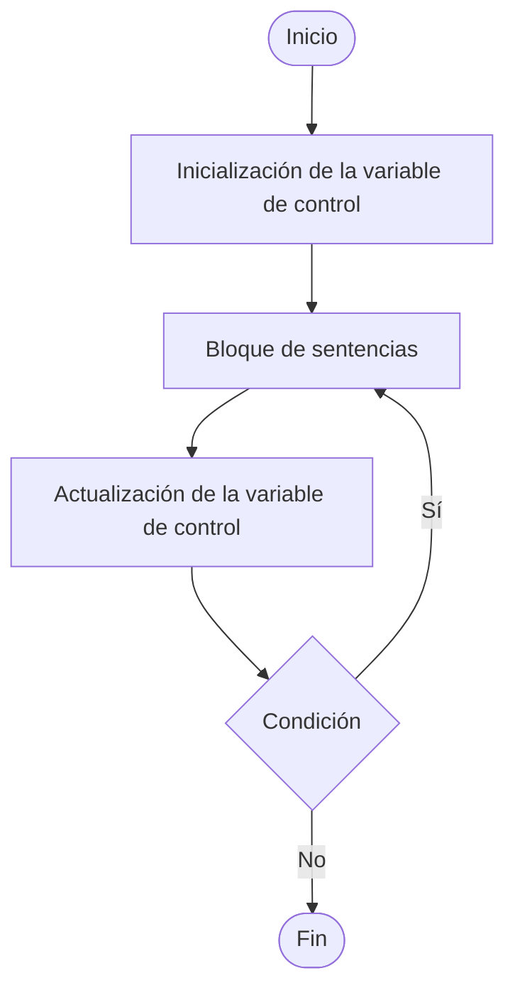
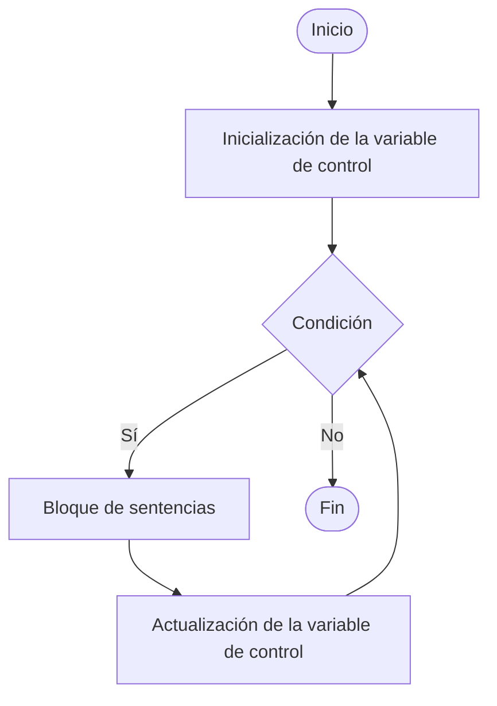

# Conceptos Java
## Variables y valores
Utiliza variables para almacenar valores. Una variable almacena un unico valor. Una varibla se define por un nombre, un tipo y un rango de valores que puede almacenar.
El nombre de una variable permite hacer referencia a ella

## Primitivos

Las variables pueden ser de un tipo primitivos de datos o una referencia a un objeto, los tipos primitivos permiten representar valores básicos.
### Números enteros 
Representa números enteros positivos y negativos.
### Numeros reales
Existen el float y double
### Caracters
Existe el char que permiter repesentar cualquier caracter unicode
### Booleano
Representa valores lógiccos verdadero o falso 

la siguiente tabla resume los tipos ´rimitivos de java
| Tipo |   Descripción | Valor mínimo y máximo |
|----|---------------|----------------------|
|byte | entero con signo | -127 a 128 |
|short | entero con signo | -32768 a 32767 |
| int | entero con signo | -2167483648 a2167483647 |
|long | entero con signo | -922117036854775808 a 9221170036854775807 |
| float | real de posición simple | &plusmn; 3.4028234747e+38 a &plusmn; 1.40239846e-45 |
| double | real de presición doble | &plusmn; 1.7976931348623157e+309 a &plusmn; 4.94065645841246544e-324 |
| char | caracteres unicode | \u0000 a \uFFFF |
| boolean | valores lógicos | true, false |
 ## Literales 
 Se denomina literal en la manera en que se escriben sus valores para cada uno de sus tipos primitivos.

### Numeros enteros
Se puede escribir en decimal, octal o en hexadecimal.
### Números reales
debe tener un punto decimal o un exponente.
### Booleanos
los valores oógicos puden ser true y false.
### Caracteres
los valores de tipo caracter representan un caracter unicode, se escriben siempre entre comillas simples.

### Textos
pertenece a la clase string y se expresa el texto entre comillas dobles.
Un texto siempre debe aparecer en una sola linea.
Para dividir el texto en varias lineas se debe utilizar el operador + para concarenar textos.

## Operadores
### Números enteros 
al realizar una operación entre dos números enteros, el resultado siempre es un número entero.
Se puede realizar operaciones unarias, aditivas, multiplicativas, de incremento y decremento, relacionales, de igualdad y de asignación.
 
#### la operación unaria permite poner un signi delante

#### la operación aditiva se refiere a la suma y a la resta

#### una operación es multiplicativa al multiplicar o dividir dos valores, el resto % calcula la división entera

#### Un incremento o decremento aumenta o decrementa en 1 el valor de una variable. Si el operador va antes de la variable ++variable, primero se realiza la operación y se modifica el valor de la variable. si el operador va después de la variable variable++, su valor se modifica al final.

#### Un operador relacional permite comparar dos valores, el resultado de la comparación es un calor boleano que undica si la relación es verdadera o falsa

#### Un operador de igualdad compara si dos valores son iguales

#### Un operador de asignación permite asignar un valor o el resultado de una operación a una variable

### Booleanos 
#### los operadores que se aplican a los operadores lógicos son negación, Y lógico O lógico.

La negación devuelve true si el operador es false 
El Y lógico devuelve false si uno de los operadores es false 
El O logico devuelve true di los dos operadores son true.

## Clases y Objetos
Los elementos abstractos de la programación orientada a objetos se denomina clases.
Un programa orientado a objetos es una colección de objetos que se crean, interaccionan entre si y dejan de existir cuando ya no son útiles durante la ejecución del programa.
Una clase es una representación abstracta de un conjunto de objetos que compartes los mismos atributos y comportamiento, una clase describe un tipo de objetos.
Un objeto es una instancia de una clase, tiene una identidad propia y un estado.
La identidad de un objeto se define por su identificador.
El estado de un objeto se define por el valor de sus atributos.
El comportamiento de un objeto queda determinado por el comportamiento la clase a la que pertenece.
Los objetos son unidades indivisibles y disponen de mecanismos de interacción llamados métodos.
Para identificar los elementos de una aplicación, debemos fijarnos en los sustantivos que utilizamos para describir los objetos reales del sistema.

### Preguntas para diseñar una aplicación orientada a objetos
¿Cuáles son los elementos tangibles de un sistema?
¿Cuáles son los atributos?
¿Cuales son sus responsabilidades?
¿Cómo se relacionan los elementos del sistema?
¿Qué objeto debe saber?
¿Que objeto debe hacer?

## Clases
Una clase se define por la palabra reservada class seguida del nombre de la clase. El nombre de la clase debe empezar en mayuscula.

<?public class Circulo 
  {
    int x;
    int y;
    int radio;
    //Se define con tres atributos, el radio y las coordenadas x,y. 
  }
?>

Una vez que se ha declarado la clase, se pueden crear objetos a partir de ella. A la creación de un objeto se le denomina instanciación. Un objeto es una instancia de una clase y el termino instancia y objeto se utilizan indistintamente.


Para crear objetos, basta con declarar una variable de alguno de los tipos de figuras geométricas.

Para crear el objeto y asignar un esácio de memoria es necesario realizar la instanciación con el operador new.

<?
  Circulo circulo1 = new Circulo();
  Circulo circulo2 = new Circulo();
?>

Los nombres circulo1 y circulo2 son las referencias válidas para utilizar ambos objetos.

### Los elementos de una clase

Una clase describe un tipo de objetos con caracteristicas comunes.

### Atributos
La información de un objeto se almacena en atributos. Los atributos pueden ser de tipos primitivos de Java o de tipo objeto.

<?
  public class Vehiculo
  {
    String matricula;
    String marca;
    String modelo;
    String color;
    double tarifa;
    boolean disponible;
  }
  // los atributos matricula, marca, modelo y color son cadenas de caracteres, tarifa es un número real y disponible es un valor lógico.
  
?>

### Métodos y constructores

Además de definir los atributos de un objeto, es necesario definir los métodos que determinan su comportamiento.

Toda clase debe definir un método especial denominado constructor para instanciar los objetos de la clase.

Para la clase vehículo, el identificador del método constructor es Vehículo. EL método constructor se ejecuta cada vez que se instancia ub objeto de la clase. Este método se utiliza para inicializar los atributos del objeto que se instancia.

Para diferenciar entre los atributos del objeto y los identificadores de los parametros del método constructor, se utiliza la palabra this. De esta forma, los parámetros del método pueden tener el mismo nombre que los atributos de la clase.
this.marca se refiere al atributo del objeto y marca al parámetro del método.

<?
  public class Vehiculo
  {
    String matricula;
    String marca;
    String modelo;
    String color;
    double tarifa;
    booblean disponible;

    // el método constructor de la clase Vehículo

    public Vehiculo(String matricula, String marca, String modelo, String color, double tarifa)
    {
      this.matricula = matricula;
      this.marca = marca;
      this.modelo = modelo;
      this.color = color;
      this.tarifa = tarifa;
      this.disponible = false;
    }
  }
?>

La instanciación de un objeto se realiza ejecutando el método constructor de la clase.


<?


  Vehículo vehículo1 = new Vehículo("4050 ABJ", "VW", "GTI", "Blanco", 100.0);
  Vehículo vehículo2 = new Vehículo("2345 JVM", "SEAT", "León", "Negro", 80.0);
?>

La instanciacion de un objeto consiste en asignar un espacio de memoria al que se hace referencia con el nombre del objeto.

Los identificadores de los objetos permiten acceder a los valores almacenados en cada objeto.
En los objetos vehiculo1, vehiculo2 almacenan valores diferentes y ocupan espacios de memoria distintos.

Para acceder a los atributos de los objetos de la clase vehículo se utilizan los métodos get y set.

Los métodos get se utilizan para consultar el estado del objeto, los métodos set para modificar su estado, puden ser modificados despues de crear el objeto. 
<?
public class Vehiculo
{
  String matricula;
  String marca;
  String modelo;
  String color;
  double tarifa;
  boolean disponible;


  public Vehícula(String matricula, String marca, String modelo, String color, double tarifa)
    {
      this.matricula = matricula;
      this.marca = marca;
      this.modelo = modelo;
      this.color = color;
      this.tarifa = tarifa;
      this.disponible = false;
    }
?>
    public String getMatricula()
    {
      return this.matricula;
    }

    public String getMarca()
    {
      return this.marca;
    }

    public String getModelo()
    {
      return this.modelo;
    }

    public String getColor()
    {
      return this.color;
    }

    public double getTarifa()
    {
      return this.tarifa;
    }

    public boolean getDisponible()
    {
      return this.disponible;
    }

    public void setTarifa(double tarifa)
    {
      this.tarifa = tarifa;
    }

    public void setDisponible(booblean disponible)
    {
      this.disponible = disponeble;
    }
}

### Representación de clases y objetos
Una clase se representa como un recuadro dividido en tres partes: el nombre de clase en la parte superior, la declaración de atributos y la declaracion de métodos.

El código java de una clase se divide en dos partes, la declaración y su definición. La declaración comienza por la palabra class y a continuación de indica el nombre de la clase; la definición de una clase queda delimitada por la llave de inicio y la llave de fin; en el bloque de definición de la clase se declaran los atributos de los objetos y los métodos que definen su comportamiento.

Los objetos se representan como cajas que indican el nombre del objeto, la clase a la que pertenecen y el estado del objeto.

En los objetos vehiculo1 y vehiculo2 son instancias de la clase vehículo, ambosa objetos comparten los mismos atributos, pero almacenan distintos valores; los valores almacenados en un objeto representan su estado.


```
Vehiculo vehiculo1 = new Vehiculo("4050 ABJ", "VW", "GTI", "Blanco",  100, true);
Vehiculo vehiculo2 = new Vehiculo("2345 JVM", "SEAT", "León", "Negro", 80.0, false);
```
El estado de un objeto puede cambiar durante la ejecución de un programa Java. En este ejemplo solo se podría modificar la tarifa del alquiler y la disponibilidad de los objetos de la clase Vehículo.

### Objetos
Un objeto se compone de atributos y métodos. Para cacceder a los elementos de un objeto se escribe el nombre del objeto, un punto y el nombre del elemento al que se desea acceder.

```
System.out.println("Matricula: " + vehiculo1.matricula);
System.out.println("Marca y modelo: " + vehiculo1.marca + " " + vehiculo1.modelo);
System.out.println("Color: " +  vehiculo.color);
Systeem.out.println("Tarifa: " + vehiculo1.tarifa);
```
Para acceder aa un metodo, además de su nombre hay que indicar la lista de argumentos requeridos por el método. Cuando la declaración del método no incluye parametros no es necesario pasar argumentos.

```
Vehiculo vehiculo1 = new Vehiculo("4050 ABJ", "VW", "GTI", "Blanco", 100.0);
System.out.println("Matricula: " + vehiculo1.getMatriculaa());
System.out.println("Tarifa: " + vehiculo1.getTarifa());
vehiculo.setTarifa(90.0);
System.out.println("Matricula: " + vehiculo1.getMatricula());
System.out.println("Tarifa: " + vehiculo1.getTarifa());
```
Para mostrar la tarifa del onjeto vehiculo1 se puede acceder directamente al atributo tarifa del objeto o se puede ejecutar el método getTarifa(). Esto se debe a que los atributos de clase vehiculo son de acceso publico (se han declarado public en vez de privte). Los atributos de la clase se deben declarar private y para acceder a ellos se debe utilzar un metodo get.

### La referencia null

Una referencia a un objeto puede no tener asignada una instancia. Esto puede ocurrir porque se ha declarado el objeto pero no se ha instanciado, no se ha creado un objeto con el operador new. Existe un valor especial llamado null que indica que un objeto no se ha instanciado.

```
Vehiculo vehiculo2;
```

Miesntras no se instancie el objeto vehiculo2 su referencia vale null.
En un programa Java no se deben dejar referencias de objetos sin instanciar. Es necesario asegurarse que los objetos existen para evitar referencias null.

El objeto se puede instanciar en la misma declarión o mas adelante.

Vehiculo vehiculo2 = new Vehiculo("2345 JVM", "SEAT", "Leon", "Negro", 80.0);

Para saber su una referencia está instanciada o no, se puede comparar con null.

```
if (vehiculo2 == null)
{
  System.out.print("vehiculo2 es una referencia null");
}

if (vehiculo2 != null)
{
  System.out.print("vehiculo2 está instanciado");
}
```
### Referencias compartidas por varios objetos
Un objeto puede tener varias referencias o nombres. Un alias es otro nombre que se referecia al mismo objetoUn alias es una referencia más al mismo espacio de memoria del objeto original.

```
Vehiculo vehiculo1;
Vehiculo vehiculo3;

vehiculo1 = new Vehiculo("4050 ABJ", "VW", "GTI", "Blanco", 100.0);

// el objeto vehiculo1 se instancia, vehiculo3 solo está declarado y es una referencia null.

vehiculo3 = vehiculo1;

// vehiculo3 se convierte en alias de vehiculo1 y referencia el mismo espacio de memoria.

System.out.println("Matricula: " + vehiculo1.getMatricula());
System.out.println("Tarifa: " + vehiculo1.getTarifa());

// Muestra la información de la matricula y tarifa de vehiculo1

System.our.println(Matricula: " vehiculo3.getMatricula());
System.out.println(Tarifa: " vehiculo3.getTarifa());

// El alias de vehiculo1, muestra de nuevo la misma información.
```
Un alias se puede utilizar para mostrar el estado de un objeto y tambien para modificarlo.

```
  vehiculo3.setTarifa(90.0);
  // al modificar la tarifa de vehiculo3w en realidad se modifica la tarifa de vehiculo1
```

El objeto vehiculo3 es un alias de vehiculo1 y no tiene un espacio de memoria propio, utiliza el mismo espacio de memoria que vehiculo1, vehiculo1 comparte con sus alias el mismo espacio de memoria.

### Ciclo de vida de un objeto

El ciclo de vida de un objeto empieza por su declaracion, su instanciación y su uso en un programa java hasta que finalmente desaparece. Cuando el objeto deja de ser utilizado, Java libera la memoria asignada al objeto y la reutilza.

El entorno de ejecuacion de java decide cuando puede reutilizar la memopria de un objeto que ha dejado de ser util en un programa, a este proceso se le conoce como recolección de basura.

### Atributos

```
public class Vehiculo
{
  private String matricula;
  private String marca;
  private String modelo;
  private String color;
  private double tarifa = 0.0;
  private boolean disponible = false; 
}
```

Los atributos son los elementos que almacenan el estado de un objeto, se definen de la misma forma que las variables, pero dentro del bloque de la clase.

Existen dos tipos de atributos: los atributos de clase y los atributos de objeto.

Los atributos de clase existen siempre, son independientes de que existan objetos instanciados se declaranutilizando static.
Los atributos de objeto existen durante el ciclo de vida de un objeto, se crean cuando se instancia el objeto y se pueden utilizar mientras el objeto exista.

El tipo de acceso puede ser private, protected o public. Los atributos de acceso private solo se pueden acceder desde la propia clase que los define, miestras que los atributos public se pueden acceder libremente desde otras clases. Los atributos protected se pueden acceder desde la clase que los define y desde sus subclases.

La inicialización del objeto es opcional, se puede declarar un objeto que será instanciado despues o se puede instanciar al momento de su declaración.

En el ejemplo anterior cuando se instancia un objeto de tipo Vehiculo se inicializan los valores de los atributos tarifa y disponible.

La clase Vehiculo se debe declarar con atreibutos privados. Se utiliza el tipo de acceso private para que solo los metodos get y set de la clase pruedan acceder a ellos.

### Métodos
Los métodos son funciones que determinan el comportamiento de los objetos. Un objeto se comporta de una u otra forma dependiendo de los métodos de la clase a la que pertence. Todos los objetos de una misma clase tienen los mismos métodos y el mismo comportamiento.

Existen tres tipos de métodos: métodos de consulta, métodos modificadores y operaciones.

Los métodos de consulta sirven para extraer información de los objetos. los métodos modificadores sirven para modificar el valor de los atributos del objeto y las operaciones definen el comportamiento de un objeto.

Los métodos get son métodos de consulta, mientras que los métodos set son metodos modificadores

Los métodos get se utilizan para extraer el valor de un atributo del objeto y los métodos set para modificarlo.

```
  public double getTarifa()
  {
    return this.tarifa;
  }
  // el metodo get se declara public
  // es valor de retorno es double, igual que el atributo tarifa
  // la lista de parametros de un método get queda vacía
  // un método get utiliza return para devolver el valor del atributo. En este caso el identificador del atributo es tarifa y se refiere a él como this.tarifa.
```

```
  public class Vehiculo
  {
    private String matricula;
    private String marca;
    private String modelo;
    private String color;
    private double tarifa = 0.0;
    private boolean disponible = false;

    public String getAtributos()
    {
      return "Matricula: " + this.matricula + "Modelo: " + this.marca        + " " + this.modelo + " Color:  " + this.color + " Tarifa: " +         this.tarifa + " Disponible: " + this.disponible; 
    }  
  }
```

El método set se declara public y devuelve void. La lista de parametros de un método set incluye el tipo y el valor a modificar.

El método setTarifa(double tarifa) debe modificar el valoe de la tarifa del alquiler almacenado en el objeto. El cuerpo de una método set asigna al atributo del objeto el parametro de la declaración.

```
public void setAtributo(double tarifa)
{
  this.tarifa = tarifa;
}
// un método set se declara public.
// el valor de retorno es void.
// la lista de parametros de un método set incluye el tipo y el nombre del parametro
// un método sset modifica el valor de un atributo del objeto. En este caso el identificador del atributo es tarifa y se refiere a él como this.tarifa para asignarle el valor del parametro.
```
Un método de tipo operación es aquel que realiza un cáculo o modifica el estado de un objeto.Este tipo de métodospueden incluir una lista de parametros y puede devolver un valor o no. Si el método no devuelve un valor, se declara void. 

```
  public class Circulo
  {
    public static final double PI = 3.1415926536;
    private double radio;

    public Circulo(double radio)
    {
      this.radio = radio;
    }

    public double getRadio()
    {
      return this.radio;
    }

    public double calcularPerimetro()
    {
      return 2 * PI * this.radio;
    }

    public double calcularArea()
    {
      return PI * this.radio * this.radio; 
    }
  }
```

### Declaración de métodos
La declaración de un método indica si el método necesita o no argumentos.

Los metodos get ni tienen argumentos y devuelven un valor, los metodos set necesitan un argumento para identificar el valor del atributo que van a modificar.

El método setTarifa (double tarifa) tiene un argumento. El nombre de este paramtro es tarifa  y su tipo es double.

Un método se declara con la siguiente sintaxis:

```
tipo-de-acceso tipo nombre (lista de métodos);
public void setTarifa(double tarifa)

// La lista de parametros puede declarar una mas variables separadas por coma.
```

### Invocación de métodos
Un método se puede invocar dentro o fuera de la clase donde se ha declarado. 
Si el método se invoca dentro de la clase, basta con indicar su nombre.
Si el método se invoca fuera de la clase entonces se debe indicar el nombre del objeto y el nombre del método.

```
public class Vehiculo
{
  private String matricula;
  private String marca;
  private String modelo;
  private String color;
  private double tarifa = 0.0;
  private boolean disponible = false;

  public String getAtributos()
  {
    return "Matricula: " + getMatricula() + " " +
           " Modelo: " + getMarca() + " " + getModelo() +
           " Color: " + getColor() +
           " Tarifa: " + getTarifa() +
           " Disponible: " + getDisponible;
  }
}
```
Si el método getAtributos() se va a incvocar desde fuera de la clase, es necesario indicar el nombre del objeto y el nombre del método.

Si el método es estático, es necesario indicar el nombre de la clase y el nombre del método.

Cunado se invica al método, en la linea de código del programa donde se invoca al métod se calculan los valores de los argumentos.
Los parametros se inicializan con los valores de los argumentos.
Se ejecuta el bloque de codigo del método hasta que se alcanza el return o se llega al final del bloque.
Si el método devuelve un valor, se sustituye la invocación por el valor devuelto.
L a ejecución del programa continua en la siguiente instruccion donde se invocó al método.

### El método main()

Todo programa Java debe tener un clase con un método main(), este método se debe declarar public static void, es un método estático, público y no deuelve valor de retorno, los parametros String[] args se refieren a la linea de comandos de la aplicacion.

Cuando la máquina virtual de Java (JVM) ejecuta un programa Java, llama al método main. Este método que a su vez que a su vez ejecuta los métodos de la aplicación.

### Parámetros y argumentos
Los parámetros de un método definen la cantidad y el tipo de dato de los valores que recibe un método para su ejecución.
Los argumentos son los valores que se pasan a un método durante su invocación.
El método recibe los argumentos correspondientes a los parametros con los que ha sido declarado.
El método puede tener tantos métodos como sea necesario.
El método constructor de la clase  vehiculo tienen cinco parématros.

```
public Vehiculo(String matricula, String marca, String modelo, String color, double tarifa)
{
}
```
El método setTarifa de la clase Vehiculo tiene un parametro tarifa de tipo double.

```
public void setTarifa(double tarifa)
{
}
```
Durante la invocación del método es necesario que el número y el tipo de argumentos coincidan con el número y el tipo de parametros declarados en la cabecera del método.

```
Vehiculo vehiculo1 = new Vehiculo();
// es correcto invocar al método setTarifa(double tarifa) del objeto vehiculo1 pasando un argumento de tipo double.
vehiculo1.setTarifa(100.0);
vehiculo1.setTarifa(90.0);

// La invocación del método no es coorecta si se pasan dos argumentos de tipo double o un argumento de tipo String porque la cabecera del método solo incluye un parametro de tipo double.
vahiculo1.setTarifa(100.0, 20.0);
vehiculo1.setTarifa("100.0");
```

### Paso de parámetros
Cunado se invoca un método se hace una copia de los valores de los argumentos en los parámetros.
Esto quiere decir que si el método modifica el valor de un parámetro, numca se modifica el valor original del argumento.

Po ejemplo, el método recibirVehiculoAlquilado(Vehiculo v) recive el prametro v de tipo vehiculo. Si el método modifica el estado de objeto v, en realidad modifica el estado del objeto original vehiculo1 que recibe como argumento.

```
public void recibirVehiculoAlquilado(Vehiculo v) {
  v.setDisponible(true)
}
```
```
public static void main(String args())
{
  Vehiculo vehiculo1 = new Vehiculo("4050 ABJ",
                                     "VW",
                                      "GTI",
                                      "Blanco",
                                       100.0);

System.out.println("El objeto vehiculo1 está disponible: " + vehiculo1.getDispoible());

recibirVehiculoAlquilado (vehiculo1);

System.out.println("El objeto vehiculo1 está disponible: "+ vehiculo1.getDisponbile());
}

// Al instanciar el objeto, el método construtor asigna el valor false al atributo disponible, pero al invocar el método recibirVehiculoAlquilado(Vehiculo v)  con el objeto vehiculo1, se modifica su disponibilidad.
```

### El valor de retorno
Un método puede devolver un valor.
Los métodos que no devuelven un valor se declaran void.
Los métodos que devuelven un valor indican el tipo que devuelven: int, double, char, String o un tipo de objeto.

Los métodos set devuelven void, mientras que los métodos get devuelven el tipo correspondiente al atributo al que hacen referencia
Los métodos set devuelven void porque son metodos modificadores, realizan operaciones y cálculos para modificar el estado de los objetos.
Los métodos get son de consulta y devuelven los valores almacenados en los atributos de un objeto.

```
public void setTarifa(doble tarifa)
{
  this.tarifa = tarifa;
}
// el método setTarifa(double tarifa) recibe el parámetro tarifa de tipo double y devuelve void.

public double getTarifa()
{
  return this.tarifa;
}
El método getTarifa() devuelve el tipo double correspondiente al atributo tarifa, el valor del atributo se devuelve con return.
```

### Las variable locales de un método
Las variables locales de un mpetodo son útiles para almacenar valores temporales cuyo tiempo de vida coincide con el método.

El método getAtributos() no utiliza variables locales. El valor re retorno se calcula al momento de hacer return.

```
public String getAtributos()
{
  return = "Matricula: " + getMatricula() + " " +
         " Modelo: " + getMarca() + " " + getModelo() +
         " Color: " + getColor() +
         " Tarifa: " + getTarifa() +
         " Disponible: " + getDisponible();
}

//Este atributo se podría codificar declarando la variable local atributos de tipo String para almacenar el valor de retorno. Esta variable se declara dentro del método.

public String getAtributos()
{
  String atributos
  atributos = "Matrivula: " + getMatricula() + " " +
              "Modelo: " + getMarca() + " " + getModelo() +
              " Color: " + getColor() +
              " Rarifa: " + getTarifa() +
              " Disponible: " + getDisponible();

  return atributos;
}

//Los dos métodos son equivalentes, pero el primero es más claro porque evita el uso de una variable local que no es necesaria.
```

### Sobrecarga de métodos
La sobrecarga de métodos es útil para que el mismo método opere con parametros de distinto tipo o que un mismo métod reciba una lista de parametros diferente.
Puede haber dos métodos con el mismo nombre que realicen don funciones distintas.
La diferencia entre los métodos sobrecargados está en su declaración.

```
public String getAtributos()
{
  return "Matricula: " + getMatricula() + " " +
         " Modelo: " + getMarca() + " " + getModelo() +
         " Color: " + getColor() +
         " Tarifa: " + getTarifa() +
         " Disponible: " + getDisponible();
}

public String getAtributos(double porcentajeDescuento)
{
  return "Matricula: " + getMatricula() + " " +
         " Modelo: " + getMarca() + " " + getModelo() +
         " Color: " + getColor() +
         " Tarifa: " + (100.0 - porcentajeDescuento/100*tarifa) +
         " Disponible: " + getDisponible();
}

// el método getAtributos() se puede sobrecargar para devolver los atributos de un vehiculo y para mostrar la tarifa reducida al aplicar el porcentaje de descuento recibido como argumento.
```
Los dos métodos se diferencian por la declaración de sus parametros y ambos métodos realizan operaciones distintas.

### Constructores

Para crear un objeto se utiliza el operador new.
Si no se ha definido un método contructor para la clase, entonces el objeto se instancia indicando el nombre de la clase y a continuación un parentesis abierto y otro cerrado.
Si ya se ha definido un método constructor, entonces no es posible instanciar un objeto utilizando un contructor por defecto.
Cuando se invoca al constructor por defectose asigna un espacio de memoria para el nuevo objeto y sus atributos se inicializan a los valores por defecto correspondientes a su tipo. Los numeros enteros se inicializan a cero, los números reales a 0.0, los valores lógicos a false, los caracteres a \u0000 y las referencias a null.

En una clase se pueden definir uno o más métodos constructores para inicializar los atributos de un objeto con valores distintos de los valores por defecto de Java.
Para instanciar un objeto es necesario indicar los valores iniciales de sus atributos cuando se ejecuta el método contructor.
En la clase Vehiculo se ha definido un método constructor que inicializa los atributos matricula, marca, modelo, color y tarifa.

```
public class Vehiculo
{
  String matricula;
  String marca;
  String modelo;
  String color;
  double tarifa;
  boolean disponible;

  // El método constructor de la clase vehiculo
  public Vehiculo(String matricula,
                  String marca,
                  String modelo,
                  String color,
                  double tarifa)
  {
    this.matricula = matricula;
    this.marca = marca;
    this.modelo = modelo;
    this.color = color;
    this.tarifa = tarifa;
    this.disponible = false;
  }
}

// this.matricula se refiere al atributo del objeto.
// matricula se refiere al parametro del método.


```

A veces es necesario contar con diferentes métodos constructores con distintos parametros. 
Se podría crear un objeto de la clase vehículo sin conocer la tarifa de alquiler. El método constructor debería inicializar la tarifa a cero.

```
public Vehiculo(String matricula,
                String marca,
                String modelo,
                String color)
{
  this.matricula = matricula;
  this.marca = marca;
  thiis.modelo = modelo;
  this.color = color;
  this.tarifa = 0.0;
  this.disponible = false;
}
```

Cuando se definen dos o más métodos constructores para la clase vehículo, se dice que le método constructor de la clase está sobrecargado.
La diferencia entre los dos métodos es que el primero recibe cinco parametros e inicializa la tarifa a cero, el segundo recibe cinco parametros, uno de ellos para inicializar la tarifa del vehículo.

```
public Vehiculo(String matricula,
                String marca,
                String modelo,
                String color)
{
}

public Vehiculo(String matricula,
                String marca,
                String modelo,
                String color,
                double tarifa)
{
}
```

```
public class Vehiculo
{
  private String matricula;
  private String marca;
  private String modelo;
  private String color;
  private double tarifa;
  private boolean disponible;

  public Vehiculo(String matricula,
                  String marca,
                  String modelo,
                  String color)
  {
    this.matricula = matricula;
    this.marca = marca;
    this.modelo = modelo;
    this.color = color;
    this.tarifa = 0.0;
    this.disponible = false;
    
  }

  public Vehiculo(String matricula,
                  String marca,
                  String modelo,
                  String color,
                  double tarifa)
  {
    this.matricula = matricula;
    this.marca = marca;
    this.modelo = modelo;
    this.color = color;
    this.tarifa = tarifa;
    this.disponible = false;
  }
}
```

Java diferencia los métodos sobrecargados por el número y el tipo de los argumentos que tiene el método. 
Cuando se invoca el método contructor de la clase con el operador new, Java selecciona el método que debe ejecutar por el número y el tipo de argumentos que recibe.

```
Vehiculo vehiculo1 = new Vehiculo("4050 ABJ",
                                  "VW",
                                  "GTI",
                                   "Blanco",
                                   100.0);

Vehiculo vehiculo2 = new Vehiculo("2345 JVM",
                                  "SEAT",
                                   "León",
                                   "Negro");
```
## Extensión de clases

### Composición

La composición consiste en crear una clase nueva agrupando objetos de clases que ya existen. 
Una composición agrupa uno o más objetos para construir una clase, de manera que las instancias de esta nueva clase contienen uno o mas objetos de otras clases.
Normalmente los objetos contenidos se declaran con acceso private y se inicializan en el constructor de la clase.

```
public class Vehiculo
{
  private String matricula;
  private String marca;
  private String modelo;
  private String color;
  private double tarifa;
  private boolean disponible;

  public Vehiculo(String matricula,
                  String marca,
                  String modelo,
                  String color,
                  double tarifa)
  {
    this.matricula = matricula;
    this.matricula = marca;
    this.modelo = modelo;
    this.color = color;
    this.tarifa = tarifa;
    this.disponible = falso;  
  } 
}
```

Para hacer una composición utilizando objetos de una clase diferente de String, lo primero es definir una nueva clase. La clase Cliente formará junto con Vehiculo la clase VehiculoAlquilado utilizando la composición.

```
public class Cliente
{
  private String nif;
  private String nombre;
  private String apellido:

  public Cliente(String nif,
                 String nombre,
                 String appellidos)
  {
    this.nif = nif;
    this.nombre = nombre;
    this.apellido = apellido;
  }
}


```

Ahora se define una composición que declara un objeto de la clase Vehiculo y un objeto de la clase cliente.
La nueva clase VehiculoAlquilado relaciona una instancia de la clase Vehiculo con una instancia de la clase cliente y crea objetos que almacenan relaciones entre clientes y vehículos de alquiler.

Esto significa que para instanciar un objeto de la clase VehiculoAlquilado es necesario tener referencias a objetos de las clases Cliente y Vehiculo.


```
public class VehiculoAlquilado
{
  private Cliente cliente;
  private Vehiculo vehiculo;
  private int diaAlquiler;
  private int mesAlquiler;
  private int añoAlquiler;
  private int totalDiasAlquiler;

  public VehiculoAlquilado(Cliente cliente,
                           Vehiculo vehiculo,
                           int diasAlquiler,
                           int mesAlquiler,
                           int añoAlquiler,
                           int totalDiasAlquiler)
  {
    this.cliente = cliente;
    this.vehiculo = vehiculo;
    this.diaAlquiler = diaAlquiler;
    this.mesAlquiler = mesAlquiler;
    this.añoAlquiler = añoAlquiler;
    this.totalDiasAlquiler = totalDiasAlquiler;
  }

  public Cliente getCliente()
  {
    return this.Cliente;
  }

  public Vehiculo getVehiculo()
  {
    return this.vehiculo;
  }
}
```

La clase VehiculoAlqulado contiene un objeto de la clase Cliente, un objeto de la clase Vehiculo y atributos de tipo int para almacenar el día, el mes y el año de la fecha del alquler del vehiculo y el total de días de alquiler.
La clase contenedora es VehiculoAlquilado y las clases contenidas son Cliente y Vehiculo.

```
public static void main(String args[])
{
  Vehiculo vehiculo1 = new Vehiculo("4050 ABJ",
                                    "VW",
                                    "GTI",
                                    "Blanco",
                                    100.0):

  Vehiculo vehiculo2 = new Vehiculo("2145 JVM",
                                    "SEAT",
                                    "León",
                                    "Negro",
                                    80.0);    

  Cliente cliente1 = new Cliente("30435624x", "Juan", "Perez");

  VehiculoAlquilado alquiler1 = new VehiculoAlquilado(cliente1,
                                                    vehiculo1,
                                                    11,
                                                    11,
                                                    2011,
                                                    2);
}


```

En una relación de composición, hay atributos de la clase contenedora que son objetos que pertenecen a la clase contenida.
Un objeto de la clase contenedora puede acceder a los métodos públicos de las clases contenidas.
En la declaración de la clase VehiculoAlquilado se han definido dos métodos get para los atributos de tipo objeto.
El método getCliente() devuelve un objeto de tipo Cliente y el método getVehiculo() devuelve un objeto de tipo Vehiculo.


El objeto alquiler1 de la clase VehiculoAlquilado puede acceder a los métodos públicos de su propia clase y de las clases Cliente y Vehiculo.
Un objeto de la clase VehiculoAlquilado puede ejecutar métodos get para mostrar la información de los objetos que contiene.

```
alquiler1.getCliente().getNIF();
alquiler1.getVehiculo().getMatricula();
```

## Herencia

La herencia es la capacidad que tienen los lenguajes orientados a objetos para extender clases. 
Esto produce una nueva clase que hereda el comportamiento y los atributos de la clase que ha sido extendida.
La clase original se denomina clase base o superclase, la nueva clase se denomina clase derivada o subclase.

### Extensión de clases

La capacidad para extender clases se llama herencia porque la nueva clase hereda todos los atributos y los métodos de la superclase a la que extiende.
Una subclase es una especialización de la superclase.
Normalmente una subclase añade nuevos atributos y métodos que le dan un comportamiento diferente a l de la superclase.
La herencia es un mecanismo muy importante porque permite la reutilización de código.

Suponga que se desea diseñar una aplicación para gestionar una empresa de alquiler de vehículos de tipo turismo, deportivo y furgonetas.
La clase vehículo define los atributos y los métodos de todos los vehículos de la empresa de alquiler.
Esto no es suficiente porque hay distintos tipos de vehiculos, de manera que es necesario definir subclases para cada tipo de vehiculo: turismo, deportivo y furgoneta.
Todas las subclases son vehículos, un turismo, un deportivo y una furgoneta, pero cada uno de ellos tiene caracteristicas propias que le hacen diferente al resto. 
Para un turismo interesa saber el número de puertas y el tipo de cambio de marchas.
Para un turismo interesa saber su cilindrada.
Para una furgoneta su capacidad de carga en kilos y el volumen en metros cúbicos.
 
La extensión de una clase tiene la siguiente sintaxis
```
public class nombre-subclase extends nombre-superclase
{
}
```
Las subclases Turismo, Deportivo y Furgoneta son especializaciones de la clase Vehiculo.
En una relación de herencia, las subclases heredan los atributos y los métodos de la superclase.
En la declaración de las subclases se indica la clase a la que extienden, en este caso Vehículo.

```
public class Turismo extends Vehiculo
{
}

public class Deportivo extends Vehiculo
{
}

public class Furgoneta extends Vehiculo
{
}
```

```
public class Vehiculo
{
  private String matricula;
  private String marca;
  private String modelo;
  private String color;
  private String tarifa = 0.0;
  private boolean disponible;

  public Vehiculo(String matricula,
                  String marca,
                  String modelo,
                  String color,
                  double tarifa)
  {
    this.matricula = matricula;
    this.marca = marca;
    this.modelo = modelo;
    this.color = color;
    this.tarifa = tarrifa;
    this.disponible = false;
  }

  public String getAtributos()
  {
    return "Matricula: " + this.matricula +
           " Modelo: " + this.marca + " " + this.modelo +
           " Color: " + this.color +
           " Tarifa: " + this.tarifa +
           " Disponible: " + this.disponible;
  }

}
```

```
public class Turismo extends Vehiculo
{
  private int puertas;
  private boolean marchaAutomatica;

  public Turismo(String matricula,
                 String marca,
                 String modelo,
                 String color,
                 double tarifa,
                 int puertas,
                 boolean marchaAutomatica)
  {
    super(matricula, marca, modelo, color, tarifa);
    this.puertas = puertas;
    this.marchaAutomatica = marchaAutomatica;
  }

  public int getPuertas()
  {
    return this.puertas;
  }

  public boolean getMarchaAutomatica()
  {
    return this.marchaAutomatica;
  }

  public String getAtributos()
  {
    return super.getAtributos() +
           " Puertas: " + this.puertas +
           " Marcha Automática: " + this.marchaAutomatica;
  }
}
```

```
public class Deportivo extends Vehiculo
{
  private int cilindrada;

  public Deportivo(String matricula,
                   String modelo,
                   String modelo,
                   String color,
                   double tarifa
                   int cilidrada)
  {
    super(matricula, marca, modelo, color, tarifa));
    this.cilindrada = cilindrada
  }

  public String getAtributos()
  {
    return super.getAtributos() +
           " Cilindrada (cm3) : " + this.cilindrada;
  }
}
```

```
public class Furgoneta extends Vehiculo
{
  private int carga;
  private int volumen;

  public Furgoneta(String matricula,
                   String marca,
                   String modelo,
                   String color,
                   double tarifa,
                   int carga,
                   int volumen;)
  {
    super (matricula, marca, modelo, color, tarifa);
    this.carga;
    this.volumen

  }

  public int getCarga()
  {
    return this.carga
  }

  public int getVolumen()
  {
    return this.volumen
  }

  public String getAtributos()
  {
    return super.getAtributos()
           + " Carga(kg): " + this.carga +
             " Volumen (m3): " + this.volumen;
  }
```
### Polimorfismo
Las clases Turismo, Deportivo y Furgoneta extienden a la clase vehículo.
Estas clases heredan los atributos del Vehículo y cada clase añade atributos y métodos propios.
La clase Turismo añade los atributos puertas, marchaAutomática y los métodos getPuertas() y getMarchaAutomatica().
La clase Deportivo añade el atributo cilindrada y el método getCilindrada().
La clase Furgoneta añade atributos carga, volumen y los métodos getCarga y getVolumen().
Además cada subclase declara un método getAtributos(). Este método también se ha declarado en la superclase.
Esto significa que el método getAtributos() de las subclases sobreescribe al método de la superclase.
Dependiendo del tipo de objeto que invoque el método, se ejecuta el método correspondiente a la clase del objeto. Por ejemplo, si el método es invocado por un objeto de la clase Turismo, entonces se ejecuta el código del método getAtributos() de la clase Turismo.
Los métodos getAtributos() de las subclases modifican el comportamiento del método getAtributos() de la superclase.
En cada método se invoca a super.getAtributos() para que muestre los atributos de un vehículo y después se muestran los atributos propios de la subclase.
Los métodos getAtributos() de las subclases sobreescriben el método getAtributos() de la superclase.
Esta caracteristica de los lenguajes de programación orientados a objetos se conoce como polimorfismo.
Un objeto de las subclases Turismo, Deportivo o Furgoneta puede invocar los métodos getMatricula(), getMarca(), getModelo(), getColor(), getTarifa(), getDisponible(), setTarifa() y setDisponible() de la superclase Vehiculo().

```
Vehiculo miVehiculo = new Vehiculo("4050 ABJ",
                                   "VM", "GTI",
                                    "Blanco",
                                     100.0);

Turismo miTurismo = new Turismo("4060 TUR",
                                "Skoda", "Fabia",
                                 "Blanco",
                                 90.0,
                                 2,
                                 false);

Deportivo miDeportivo = new Deportivo("4070 DEF",
                                       "Ford", "Mustang",
                                        "Rojo",
                                        150.0,
                                        2000);

Furgoneta miFurgoneta = new Furgoneta("4080 FUR",
                                      "Fiat", "Ducato",
                                      "Azul",
                                      80.0,
                                      1200,
                                      8);
```

### Compatibilidad de tipos
En una relación de tipo herencia, un objeto de la superclase puede almacenar un objeto de cualquiera de sus subclases.
Un objeto de la clase vehículo puede almacenar un objeto de la clase Turismo, Deportivo o Furgoneta.
Cualquier referencia de la clase Vehiculo puede contener una instancia de la clase Vehiculo o bien una instancia de las subclases Turismo, Deportivo o Furgoneta.
La base o superclase es compatible con los tipos que derivan de ella, pero no al revés. Una referencia de la clase Turismosolo puede almacenar una istancia de Turismo, nunca una instancia de la supercla Vehículo.

#### Conversión ascendente de tipos

Cuando un objeto se asigna una referencia distinta de la clase a la que pertenece, se hace una conversión de tipos. Java permite asignar un objeto a una referencia de la clase base.
Si un objeto de la clase Turismo se asigna una referencia de la clase Vehiculo, se hace uan conversión ascendente de tipos, denominada upcasting. La conversión ascendente de tipos siempre se puede realizar.

```
Vehiculo miVehiculo = new Turismo("5090 TUR",
                                  "Skoda", "Fabia",
                                   "Negro",
                                    90.0,
                                    2,
                                    true);
System.out.println("Vehiculo " + miVehiculo.getAtributos);

//Se crea un objeto de la clase Vehiculo utilizando el contructor de la clase derivada Turismo.

//Dado que la instancia es de tipo Turismo, al invocar al método, al invocar al método getAtributos() muestra los atributos de un Turismo.
```

### Conversión descendente de tipo
Si una instancia de la clase base Vehiculo almacena una referencia de un objeto de una de sus clases derivadas, entonces es posible hacer una conversi´n descendente de tipos, denominada downcasting.
El objeto miVehiculo de la clase base Vehiculo almacena una referencia a un objeto de la clase derivada turismo. En este caso, está permitido hacer una conversión descendente de tipos. 
La conversión se debe hacer de forma explicita, indicando el nombre de la clase a la que se desea covertir.

```
Vehiculo miVehiculo = new Turismo("4090 TUR",
                                   "sKODA", "Fabia",
                                   "Negro",
                                    90.0,
                                    2,
                                    true);

Turismo miNuevoTurismo = (Turismo) miVehiculo;

```
El objeto de la clase Vehiculo almacena un objeto de la clase derivada Turismo.
El objeto miVehiculo se convierte de forma explicita a un objeto de tipo Turismo utilizando el casting (Turismo).
Solo así es posible realizar la asignación a una referencia que ha sido declarada de tipo Turismo
Es importante señalar que el downcasting no siempre es legal y puede producir un error durante la ejecución del programa Java.

## Jerarquía de herencia
Cualquier clase de Java puede ser utilizada como una clase base para extender sus atributos y comportamiento.
La clase derivada que se obtenga, puede a su vez ser extendida de nuevo.
La relación de herencia es transitiva y define una jerarquía.
En java todas las clases está relacionadas en una única jerarquía de herencia puesto que toda clase hereda explicitamente de otra o bien implicitamente de object.
La clase Vehiculo no extiende explicitamenteotra clase, por lo que se puede decir que es una extensión de la clase object de Java.
Esto quiere decir que cualquier objeto de un programa Java se puede ver como una instancia de la clase Object.

# Ampliación de clases

## Elementos de clase (Static)
Los atributos y métodos de una clase precedidos con la palabra static se denominan elementos de clase.
Solo existe un elemento estático para todos los objetos de una misma clase.
Esto significa que los elementos de clase son compartidos por todas las instancias de la clase.
Cuando se modifica un elemento de clase todas las instancias de la clase ven dicha modificación.
Los atributos de clase deben tener un valor inicial aunque no exista ninguna minstancia en la clase.
Si el elemento de clase es un valor constante, entonces se debe indicar la palabra final.

```
public class Circulo
{
  public static final double PI = 3.1415926536;
  private double radio;

  public Circulo(double radio)
  {
    this.radio = radio;
  }

  public double getRadio()
  {
    return this.radio;
  }

  public double calcularPerimetro()
  {
    return 2 * PI * this.radio;
  }

  public double calcularArea()
  {
    return PI * this.radio * this.radio;
  }
}
```

```
public class PerimetroAreaCircunferencia
{
  public static void main (string[] args)
  {
    System.out.printtn("El valor de PI es " + Circulo.PI);
    Circulo miCirculo = new Circulo(10.0);

    System.out.println("El radio del circulo es " +
                         miCirculo.getRadio() +
                         "su perimetro es " +
                          miCirculo.calcularPerimetro() +
                         " y su area es " + miCirculo.calcularArea());
  }
}
```

## Derechos de acceso

El estado de un objeto está dado por el conjunto de valores de sus atributos.
Una modificación arbitraria, intencionada o no, puede provocar inconsistencias  o comportamientos no deseados de un objeto.
Por este motivo se debe controlar el acceso a los atributos de los objetos.
Java proporciona mecanismos de acceso a los elementos de una clase de forma que se puede determinar el derecho de acceso a cada elemento según las necesidades de los objetos.

### Acceso privado 
Los elementos privados solo se pueden utilizar dentro de la clase que los define. Para indicar el acceso privado se utiliza private.

### Acceso de paquete
El acceso a estos componentes es libre dentro del paquete en que se define la clase. El acceso de paquete no se indica expresamente.

### Acceso protegido 
Los elementos protegidos solo se puede utilizar dentro de la clase que los define, aquellas clases que la extiendan y cualquier clase definida en el mismo paquete. Para indicar el acceso protegido se utiliza protected.

### Acceso publico
Los elementos públicos se pueden utilizar libremente. Para indicar expresamente el acceso público se utiliza public.
No es necesario, el acceso publico se utiliza como valor por defecto mientras no se indique private o protected.

Para limitar el acceso a los atributos de la clase Vehiculo se utiliza private.
Al utilizar este tipo de acceso, solo los métodos get y set de la clase pueden acceder a ellos.

```
public class Vehículo
{
  private String matricula;
  private String marca;
  private String midelo;
  private String color;
  private double tarifa;
  private boolean disponible;
}
```
Con esta declaración, todos los atributos de la clase tienen acceso private, y el diagrama de clases muestra un signo menos delante del udentificador del atributo para indicar que es privado.


La clase vehículo con sus métodos get y set.

```
public class Vehículo
{
  private String matricula;
  private String marca;
  private String modelo;
  private String color;
  private double tarifa;
  private boolean disponible;

  public String getMatricula()
  {
    return this.matricula;
  }

  public String getMarca()
  {
    return this.marca;
  }

  public String getModelo()
  {
    return this.modelo;
  }

  public String getColor()
  {
    return this.color;
  }

  public double getTarifa()
  {
    return this.tarifa;
  }

  public boolean getDisponible()
  {
    return this.disponibke;
  }

  public void setTarifa(double   tarifa)
  {
    this.tarifa = tarifa;
  }

  public void set.Disponible(boolean disponible)
  {
    this.disponible = disponible;
  }
}
```

la clase Vehiculo define métodos get para los atributos matricula, marca, modelo, color, tarifa y disponible.
Los métodos set solo son aplicables a los atributos tarifa y disponible porque se considera que el resto de atributos de la clase no pueden midificar su valor una vez que se ha creado el objeto.

La responsabilidad de modificar los atributos de los objetos es de los métodos set.
Estos métodos deben verificar que el valor que se desea asignar a un atributo es valido y cumple con las condiciones del diseño de la clase.

### Paquetes
Los paquetes son grupos de clases, interfaces y otros paquetes que están relacionados entre sí. Los paquetes aportan una forma de encapsulación a un nivel de un nivel superior al de las clases.
Permiten unificar un conjunto de clases e interfaces que se relacionan funcionalmente.
El oaquete java engliba un conjunto de paquetes con utilidades de soporte para desarrollo y ejecución de aplicaciones como util o lang.


Un paquete se declara con la siguiente sintaxis.

```
package nombre-del-paquete 
```

Se podría definir el paquete vehiculos para la aplicación de la empresa de alquiler de vehículos.

```
package vehiculos;
```

### Uso

Para utilizar componentes que están en otro paquete diferente se debe añadir la declaración de importación

El uso de un paquete se declara con la sguiente sintaxis:

```
import nombre-del-paquete;
```

Se puede importar un paquete entero o un componente del paquete.
Si se declara importar las librerías para cálculos matemáticos de Java.

```
import java.math.*;
```

Si solo se desea importar una librería, entonces se debe indicar el nombre del paquete y del componente.
Se importa el componente Calendar de la librería de utilidades de Java.

```
import java.util.Calendar;
```

La declaración de importación se incluye antes de la declaración de la clase.

Se incluye el componente Calendar de util y se utiliza el método getInstance() para obtener el día, el mes y el año de la fecha actual.

```
import java.util.Calendar;

public class CalcularFechaHoy
{
  public static void main (String[] args)
  {
    int edad, diaHoy, mesHoy, añoHoy;
    diaHoy = Calendar.getInstance().get(Calendar.DAY_OF_MONDAY);
    mesHoy = Calendar.getInstance().get(Calendar.MONTH) + 1;
    añoHoy = Calendar.getInstance().get(Calendar.YEAR);

    System.out.println("La fecha de hoy es " + diaHoy + "/" +
                        mesHoy + "/" +
                        añoHoy);

  }
}
```
### Nombres
El nombre de un paquete debe ser representativo de su contenido.
El nombre puede contener la declaración de subpaquete.
Se puede incluir el nombre de la empresa que ha desarrollado el paquete para facilitar su identificación.

```
package nombre-de-la-empresa.nombre-del-paquete;
```
El paquete vehiculos de la empresa "Mi Empresa" se podría identificar:

```
package miEmpresa.vehiculos;
```

## Clases predefinidas

Una caracteristica importante de Java es que apota gran cantidad de clases predefinidas.
Estas clases están especializadas en comunicaciones, web, interfaz de usuario, matemáticas y muchas otras aplicaciones.

### Las clases asociadas a los tipos primitivos

Los tipos predefinidos boolean, char, int, float y double son tipos dimples, no son clases.
Para facilitar la programación en Java se han creado clases asociadas  a los tipos predefinidos.
Estas  clases proporcionan métodos útilies  para convertir cadenas de texto a otros tipos, para imprimir los números con diversos formatos y para describir los tipos simples.
Estas clases generan automaticamente una instancia cuando se usan tipos simples en contextosen los que se espera un objeto.
Pueden utilizarce en expreciones donde se espera un tipo simple. 

| Clase  | Tipo ptimitivo asociado |
| ------------- |:-------------:|
| Boolean      | boolean     |
| Character      | Char     |
| Integer      | int     |
| Long      | long     |
| Float      | float     |
| Double      | double     |

Estas clases tienen los siguientes métodos:

#### Método constructor a partir de un valor de tipo simple
Character letra = new Character('A');
Integer numero = new Integer(10);

#### Método constructor que recibe una cadena de texto y la traduce al tipo simple
Integer numero = new Integer("120");

#### Método toString() que transforma el valor almacenado en una cadena
Integer numero = new Integer("100");
System.out.println(numero.toString());

#### Método equals() para comparar el valor almacenado
Integer numero1 = new Integer("100");
Integer numero2 = new Integer("101");
System.out.println(numero2.equals(numero1));

### La clase Math
La clase Math contiene constantes y metodos de uso comun en matemáticas. Todas las operaciones que se realizan  en esta clase utilizan el tipo dobule.
Contiene la constante pi (Math.PI) y el número de euler (Math.E).
En las funciones trigonométricas, los angulos se expresan en radianes y los métodos devuelven valores de tipo double.
La clase Math incluye funciones como potenciación, redondeo, cuadrado, raíz cuadrada y mucho más.

### La clase String
La clase String se usa para manejar cadenas de caracteres de cualquier longitud. 
Un objeto String se puede crear a parttir de una secuencia de caracteres delimitados por comillas dobles.

```
String nombre = "Juan";
String apellidos = "Gonzalez Lopez";
```

Un objeto String tambien se puede crear utilizando el contructor de la clase.

```
String mensaje = new String("Hola Mundo");
```

La clase String tiene un tratamiento particular en Java.
Además de la construcción de objetos a partir de literales entre comillas, se pueden aplicar los operadores + y += para concatenar objetos tipo String.

```
String hola = new String("Hola");
String espacio = new String(" ");
String mundo = new String("Mundo");
String holaMundo = hola + espacio + mundo;
System.out.println(holaMundo); 
```

Para conocer la longitud de un objeto String se utiliza el método length(). 
El objeto holaMundo tiene una longitud de 10 caracteres.

```
System.out.println("El texto " + holaMundo + " tiene " + holaMundo.length() + " letras");
```
Para comparar cada letra de dos objetos de tipo String se utiliza el método contentEquals().

```
String nombre1 = "Angel";
String nombre2 = "Carlos";
System.out.println(nombre1.contentEquals(nombre2));
```

El método String.valueOf() devuelve una cadena correspondiente al valor de su parámetro. 
Este método está sobrecargado y acepta tipos boolean, char, int, long, float y double.

```
String año = String.ValueOf(2011);
```

El método charAt(int posicion) de la clase String  devuelve el carácter almacenado en la posición indicada  de una cadena de caracteres.
El primer caracter de una cadena se almacena en la posición cero y el último en la posición correspondiente a la longitud de la cadena -1.

```
String holaMundo = "Hola Mundo";
System.out.println("La primera letra de 'Hola Mundo'" + " es " + holaMundo.charAt(0));
```

## Estructra de control

El cuerpo de un programa se compone de un conjunto de sentencias que especifican las acciones que se realizan durante su ejecucuón. 
Dentro de cualquier programa, se escriben sentencias que definen la secuencia de acciones a ejecutar.
Estas sentencias incluyen acciones de clculo, entrada y salida de datos, almacenamiento de datos, etc.
Las sentencias se ejecutan una a una  en el orden en que han sido escritas.
Se denomina flujo de un programa al orden de ejecución de las sentencias que forman parte del cuerpo de un programa.
Las estructuras de control son una caracteristica básica de los lenguajes que se utiliza para modificar el flujo del programa.

Hay casos en los que el flujo del programa debe ajustar determinadas instrucciones solo cuando se cumple una condición. 
En otras ocaciones, debe repetir un conjunto de sentencias un número determinado de veces.
Las estructuras de control permiten condicionar el flujo de ejecución dependiendo del estado de la variable de un programa.

Las estructuras de control básicas se pueden clasificar  en estructuras de selección, de repetición y de salto.

Selección. Permiten decidir si se ejecuta un bloque de sentencias o no.
Repetición. Permiten ejecutar un bloque de sentencias.
Salto. Permiten dar un salto y continuar la ejecución de un programa en un punto distinto de la siguiente sentencia en el orden natural de ejecución.

Las estructuras de control se pueden combinar sin ningún tipo de limitación. 
Cualquier nuevo bloque de sentencias puee incluir  estructuras de control a continuación de otras.
Cuando se incluyen varias estructuras seguidas unas de otras, se dice que son estructuras de control apiladas.

Por otras parte, dentro de un bloque de una estructura de control se puede incluir una estructura de control y dentro de este nuevo bloque se puede incluir otra estructura de control y asi sucesivamente.
Cuando una estructura  contiene otra estructura, se dice que son estructura de control anidadas.

Es importante destacar que no existe limitación  en cuanto al número  de estructuras de control apiladas o anidadas que se pueden utilizar en un programa Java.
La única restricción a tene en cuenta es la claridad y la legibilidad del programa.

### Estructura de Selección
Las estructura de selección permiten modificar el flujo de un programa.
La decisión de ejecutar un bloque de sentencias queda condicionada por el valor de una expresión lógica definida utilizandp variables del programa.

#### Estructura if
La estructura if se denomina estructura de selección única porque ejecuta un bloque de sentencias solo cuando se cumple la condición del if.
Si la condición es verdadera se ejecuta el bloque de sentencias.
Si la condición es falsa, el flujo del programa continua en la sentencia inmediatamente posterior al if.

La sentencia if tiene la siguiente sintaxis:

```
if (condicion)
{
  bloque de sentencias
}
```
La condición es una expresión que evalúa un valor logico, por lo que el resultado solo puede ser true o false.
La condición siempre se escribe entre parentesis.
La selección se produce sobre el bloque de sentencias delimitado por llaves.
Si el bloque de sentencias solo tienen una sentencia, entonces se puede escribir sin llaves, 
```
if (condicion)
  sentencia;
```

Cuando el flujo del programa llega auna estructura if, se evalúa la condición y el bloque de instrucciones se ejecuta si el valor de la condición es true.
Si la condición es false, entonces se ejecuta la sentencia inmediatamente posterior al if.

Si la calificación de un alumno es 10, entonces se debe mostrar por la consola un mensaje indicanco que tiene una matricula de honor.

La sentencia if considerando que calificación es una variable de tipo int:

```
if (calificacion == 10)
{
  System.out.println("Matricula de honor")
}
```
El mendaje "Matricula de honor" solo se muestra cuando el valor de la calificación es igual a 10.

### Estructura if else
La estructura if-else se denomina de selección doble porque selecciona entre dos bloques de sentencias mutuamente excluyentes.
Si se cumple la condición, se ejecuta el bloque de sentencias asociadas al if.
Si la condición no se cumple, entonces se ejecuta el bloque de sentencias asociadas al else.

Una sentencia if-else tiene la siguiente sintaxis.

```
if (condicion)
{
  bloque de sentencias if
}
else
{
  bloque de sentencias else
}
```

La condicion se debe inscribir en parentesis.
La seleción depende del resultado de evaluar la condición
Si el resultado es true, se ejecuta el bloque de sentencias if, en cualquier otro caso se ejecuta el bloque de instrucciones del else.
Despues de ejecutar el bloque de sentecias se ejecuta la sentecias inmediatamente posterior al if-else.

Si se desea mostrar un mensaje por la consola para indicar si un número es par o impar basta con calcular el resto de la división del número entre 2 con el operador %.
Si el resto es igual a cero, entonces el número es par, en caso contrario es impar.

```
if (numero % 2 == 0)
  System.out.println("El número es par");
else
  System.out.println("El número es impar");
```

Los bloques de sentencias son mutuamente excluyentes. 
Si se cumple la condición se ejecuta un bloque de sentencias.
Se podría escribir una sentencia if-else con la condición contraria y con los bloques de sentencias intercambiadas.

```
if (numero % 2 != 0)
  System.out.println("El número es impar");
else
  System.out.println("El número es par");
```

Si fuera necesario evaluar más de una condición, entonces se deben utilizar varias estructura  de selección anidadas.
Para mostrar la calificación de un alumno, es necesario evaluar las condiciones que se indican en la siguiente tabla.

| Calificación  | Descripción |
| ------------- |:-------------:|
| 10      | Matrícula de honor     |
| 9      | Sobresaliente     |
| 7, 8      | Notable     |
| 6      | Bien    |
| 5      | Aprobado     |
| 0, 1, 2, 3, 4      | Suspenso     |

Se puede ver que las condiciones son excluyentes entre sí. Si la calificación es 10 se muestra "Matrícula de honor". 
En caso contrario la calificación es menor de 10 y es necesario seleccionar entre "Sobresaliente", "Notable", "Bien", "Aprobado", y "Suspenso".
Si la calificación es 9 se muestra "Sobresaliente".
En caso contrario la calificación es menor de 9 y se debe seleccionar entre "Notable", "Bien", "Aprobado" y "Suspenso".
Si la calificación  es mayor o  igual a 7 se muestra "Notable".
En caso contrario la calificación es menor que 7 y se debe seleccionar entre "Bien", "Aprovado", y "Suspenso".
Si la calificación es 6 se muestra "Bien".
En caso contrario es menor o igual a 6 y se debe seleccionar entre entre "Aprobado" y "Suspenso".
Si la calificación es 5 se muestra "Aprobado", en caso contrario "Suspenso".

La sentencia if-else

```
int calificación = 7;

if (calificación == 10)
  System.out.println("Matricula de Honor");
else
  if(calificación == 9)
    System.out.println("Sobresaliente");
  else
    if(calificacion == 7)
      System.out.println("Notable");
    else
      if(matricula == 6)
        System.out.println("Bien");
      else
        if(calificacion == 5)
          System.out.println("Aprobado");
        else
          System.out.println("Suspenso");
```
### Estructura if else if
La estructura if-else-if se puede aplicar en los mismos casos en el que se utiliza un if.else anidado. 
Esta estructura  permite escribir  de forma abreviadalas condiciones de un if-else anidado.
Una sentencia if-else-if tiene la siguiente sintaxis:

```
if (condicion-1)
{
  bloque-de-sentencias-condicion-1
}
else-if (condicion-2)
{
  bloque de sentencias-condicion-2
}
else
{
  blque-de-sentencias-else
}
```
La sentencia if-else-if para el ejemplo de calificaciones

```
int calificacion = 7;

if (calificacion == 10)
{
  System.out.println("Matricula de Honor");
}
else if (calificacion == 9)
{
  System.out.println("Sobresaliente");
}
else if (calificacion >= 7)
{
  System.out.println("Notable");
}
else if (calificacion == 6)
{
  System.out.println("Bien");;
}
else if (calificacion == 5 )
{
  System.out.println("Aprobado");
}
else
{
  System.out.println("Suspenso");
}

```

### Estructura switch
La estructura switch es una estructura de selección múltiple que permite seleccionar un bloque de sentencias  entre varios casos.
En cierto modo, es parecido a una estructura if-else anidados.
La diferencia está en que la selección del bloquie de sentencias depende de la evaluación de uan expresión que se compara por igualdad con cada uno de los casos.
La estructura switch consta de una expresión  y una serie de etiquetas case y una opción default.
La sentencia break indica el final de la ejecucióndel switch.

Una sentencia switch tiene la siguiente sintaxis

```
switch (expresion)
{
  case valor-1:
    bloque-se-sentencias-1;
    break;

  case valor-2:
    bloquie-de-sentencias-2;
    breack;

  case valor-3
    bloque-de-sentencias-3;
    break;

  case valor-4:
    bloque-de-sentencias-4;
    break;

  case valor-5:
    bloque-de-sentencias-5;
    break;

  default:
    bloque-de-sentencias-default;
    break;

}
```
La expresión debe devolver un valor de tipo entero (int) o caracter (char) y es obligatorio que la expresión se escriba entre parentesis.
A continuación de cada case aparece valores constantes del mismo tipo de valor que devuelve la expresión del switch.
Para interrumpir la ejecución  de las sentencias del switch se utiliza la sentencia break que provoca la finalizxación del switch.
El flujo del programa continúa en la sentencia inmediatamente posterior al switch.
Una vez que se evalúa la expresión del switch  se comprueba si coincide  con el valor del primer case.
En caso contrario, se comprueba si coincide con el valor del segundo case y así sucesivamente.
Cuando el valor de la expresión conincide con el valor de uno de los case, se empieza a ejecutar el bloque de instrucciones correspondiente al casehasta encontrar una sentencia break o al llegar al final de la estructura switch donde se cierra la llave.
Si no encuentra un case que coincida con el valor de la expresión, se ejecuta el bloque de sentencias correspondiente a la etiqueta default.

Para asegurar el correcto flujo de ejecución de un programa durante la evaluación de una sentencia switch, es recomendable incluir una sentencia break al final del bloque de instrucciones de cada case, incluido el correspondiente a la etiqueta default.
Esto es importante, porqur si se omite la sentencia break, cuando finaliza la ejecución del bloque de sentencias de un case, el flujo del programa continua ejecutando los case siguietes y esto puede provocar un comportamiento erróneo del programa.
Suponga que una empresa de consultoría la categoría profesional de un empleado se calcula a partir de su tasa de coste. La tabla muestra los valores de las tasas y sus correspondientes categorias.

| Calificación | Descripción |
------------------------------
| Menr de 80 | La categoría es C de consultor junior |
| Mayor o igual a 80 y menor que 120 | La categoría es B de consultor senior |
| Mayor o igual a 120 | La categoria es A de socio |

```
public class CategoriasProfesionales
{
  public static void main(String[] args)
  {
    int tasaEstandar = 150;
    char categoriaProfesional;

    if (tasaEstandar < 80)
      categoriaProfesional = 'C';
    else
      if(tasaEstandar < 120)
        categoriaProfesional = 'B';
      else
        categoriaProfesional = 'A';

    System.out.print("Tasa " + tasaEstandar + " euros. ");
    System.out.print("Categoria " + categoriaProfesional + " de ");

    switch (categoriaProfesional)
    {
      case 'A': System.out.print("Socio ");
                break;
      case 'B': System.out.print("Senior ");
                break;
      case 'C': System.out.print("Junior ");
                break;
      default: System.out.print("¡ Indefinida !");
               break;
    }
  }
}

// la sentencia break al final de cada case asegura que solo se ejecuta el case y después finaliza en switch
```

Para evitar que se ejecute mas de un bloque de sentencias de un switch se debe incluir un break al final del bloque de cada case. Si no es así el primer case no finaliza la ejecución del switch y se ejecutan los bloques de sentencias correspondientes al segundo case, al tercer case, y al default.
El programa mostraría por consola el mensaje:

```
Tasa 90 euros, categoria 'A' de socio Senior Junior ¡Indefinida!
```

Volviendo al ejemplo de las calificaciones que antes se ha codificado utilizando if-else anidados, ahora se utiliza un switch.

```
public class Calificaciones
{
  public static void main(String[] args)
  {
    int calificacion = 9;
    switch (calificacion)
      {
        case 0:
        case 1:
        case 2:
        case 3:
        case 4: System.out.println('Suspenso');
                break;
        case 5: System.out.println('Aprobado');
                break;
        case 6: System.out.println('Bien');
                break;
        case 7:
        case 8: System.out.println('Notable');
                break;
        case 9: System.out.println('Sobresaliente');
                break;
        case 10: System.out.println('Matricula de Honor');
                break;
        default System.out.println('No presentado');
                break;
      }
  }
}
```

Es importante ver que los case correspondientes a los valores 0, 1, 2 y 3se han dejado vacios porqur el bloque de sentencias para estos casos es el mismo que el case 4.
Para evitar repetir este código varias veces no se incluye el break.
Cuando se cumple uno de ellos, se ejecuta el bloque de sentencias correspondiente al case, que para los valores 0, 1, 2, 3 está vacio. Como no hay break, se ejecutan las siguientes lineas del programa hasta llegar al bloque de sentencias  correspondiente al case 4, que muestra el mensaje "Suspenso" y cuando encuentra el break finaliza el switch.
El switch se diferencia de otras estructuras en que no es necesario delimitar entre llaves el bloque de sentencias de cada case. Solo son obligatorias las llaves de inicio y fin del switch.
En una estructura switch es obligatorio que los valores de los distintos casos sean diferentes.
Si no hay un caso que coincida con el valor de la expresión y no se incluye la etiqueta default, entonces el switch no ejecuta ninguno de los bloques de sentencias.
Conviene recordar  que un switch es una estructura apropiada para sellecionar entre un conjunto de opciones sinples y predefinidas.
No se puede aplicar cuando la selección se basa en opciones complejas o cuando dependen de un intervalo de valores. En este caso es necesario utilizar una estructura if-else anidada.

## El operador condicional
El operador condicional (?:) se relaciona con la estructura if-else.
Es el único operador de Java que utiliza tres operandos.
El primer operando es una condición lógica, el segundo es valor que toma la expresión cuando la condición es true y el tercero es el valor que toma la expresión cuando la condición es false.
El operador evalúa la condición delante del simbolo ?, que puede escribirse entre parentesis.
Si vale true devuelve el valor que aparece a continuación del signo ?. Si es false devuelve el valor que aprece a continuación de los dos puntos.

```
condicion-logica ? valor-si-verdadero : valor si falso

// la codición lógica tambien se puede expreasr entre parentesis

(condicion-logica) ? valor-si-verdadero : valor-si-falso
```
D espués de evaluar la condición lógica, se devuelve el valor correspondiente al resultado lógico verdadero o falso.

```
// Dada la edad de una persona, se desea mostrar un mensaje por la consola que indique si es mayor de edad o no.

int edad = 16;
String txt;
txt = (edad >= 18) ? 'Mayor de edad' : 'Menor de edad';
System.out.print(txt);

// la condición lógica es edad mayor o igual a 18 años.
// si es verdadera, el operador devuelve el texto 'Mayor de edad', en caso contrario devuelve 'Menor de edad'.
```
## Estructura de repetición
Las estructuras de repetición permiten repetir muchas veces un bloque de sentencias. A estas estructuras tambien se les conoce como estructuras iterativas o bucles.

Como las estructuras de seleccion,  las estructuras de repetición se pueden combinar y anidar.
Es frecuente utilizar una estrucutra de repetición que contenga un bloque de sentencias que combine otras estructuras de repetición y de selección.

Las estructuras de repetición se componen de cuatro partes: la inicialización, la condición, el bloque de sentencias y la actualización.

Inicialización: permite inicializar la estructura iterativa, normalmente consiste en la declaración e inicialización de la variable de control del bucle.

Condición: define la condición que se evalúa para ejecutar el bloque de sentenciasde la estructura iterativa. Dependiendo del tipo de de estruvtura que se utilice, la condición se comprueba antes o después de realizar cada iteración.
Bloque de sentencias: conjunto de sentencias que se ejecutam dentro de la estructura iterativa.
Actualización: Actualización de la variable de control del bucle. Normalmente se realiza al finalizar la ejecución del bloque de sentencias.

## Estructura while
La estructura de repetición while repite el bloque de sentencias mientras la condición del while es verdadera.
El diagrama de flujo de una estrucutra while muestra que la condición mustra que la condición se verifica justo despues de inicializar la variable de control.
Si el resultado de evaluar la condición por primera es falso, entonces no se ejecuta el bloque de sentencias

```flow
st=>start: Login
op=>operation: Inicialización de la variable de control
cond=>condition: Condición
e=>end: Fin

st->op->cond
cond(yes)->op
cond(no)->e
```

Un while tiene la siguiente sintaxis:

```
inicializacion:
while (condicion)
{
  bloque-de-sentencias:
  actualización;
}
```
Est es la sintaxis genera. la condición del while se escribe obligatoriamente entre paréntesis.

Un while no necesariamente requiere inicialización y actualización de una variable de control. En ese caso solo es necesari incluir la condición y el bloque de sentencias:

```
while (condicion)
{
  bloque-de-sentencias;
}
```

Cuando el programa ejecuta un while, lo primero que hace es evaluar la condición. Si es verdadera ejecuta el bloque de sentencias, si es falsa finaliza el while.
En cada iteración, cuando finaliza la ejecución del bloque de sentencias se vuelve a evaluar la condición.
De nuevo, si es verdadera ejecuta una vez más el bloque de sentencias, si es falsa finaliza el while. Cunado esto se produce, el flujo del programa continua en la sentencia inmediatamente posterior al while.

Si la primera vez que se evalúa la condición el resultado es falso, entonces no se ejecuta el bloque de sentencias. Por esta razón, se dice que un while se ejecuta cero o más veces.
Si la condición siempre es veradera, entonces el while nunca termina y se ejecuta indefinidamente. Esto se conoce como blucle infinito.

Función factorial de un número entero positivo 'n'.
```
0! = 1
1! = 1
2! = 2 x 1
3! = 3 x 2 x 1
4! = 4 x 3 x 2 x 1
n! = n x (n-1) x (n-2) x (n-3) x ... x 1
```

```
Public class FactorialWhile
{
  public static void main(String[] args)
  {
    int n = 5;
    int i = 1;
    int factorial = 1;
    while (n <= i)
    {
      factorial = factorial * n;
      n--;
    }

    System.out.println("El factoriaal de "  + n + " es " + factorial);
  }
}
```
La expresión factorial = factorial * n la variable factorial aparece dos veces. 
Primero se calcula el producto factorial  *n y después se asigna ese resultado a la variable factorial

| n | i | factorial * n | factorial |
-------------------------------------
| 5 | 1 |   1 * 5       |    5      | 
| 4 | 1 |   5 * 4       |    20      | 
| 3 | 1 |   20 * 3       |    60     |
| 2 | 1 |   60 * 2       |    120    |
| 1 | 1 |   120 * 1       |    120    |

## Estructura do-while
La estructura de repetición do-while ejecuta el bloque de sentencias al menos una vez. Despues comprueba la condición y repite el bloque de sentencias mientras la condición es verdadera.

El diagrama de flujo de una estructura do-while muestra que la condición se verifica al final, después de ejecutar el bloque de sentencias la primera vez.



Un do-while tiene la siguiente sintaxis:
```
inicialización;

do
{
  bloque-de-sentencias;
  actualizacion;
} while (condicion);
```
La condición del do-while se escribe obligatoriamente entre parentesis.

Un do-while no necesariamente utiliza un a variable de control. En ese caso solo es necesario incluir la condición y el bloque de sentencias.

```
do
{
  bloque de sentencias;
} while (condicion)
```
Cuando el programa ejecuta un do-while, lo primero que hace es ejecutar el bloque de sentencias y luego evalua la condición. Si es verdadera, ejecuta de nuevo el bloque de sentencias, si es falsa finaliza el do-while.

En cada iteración, cuando finaliza la ejecución del bloque de sentencias se vuelve a evaluar la condición. De nuevo si es verdadera ejecuta una vez más el bloque de sentencias, si es falsa finaliza el do-while. Cunado esto se produce, el flujo del programa continúa en la sentencia inmediatamente posterior al do-while.

Programa que calcula la función factorial de un número utilizando la estructura do-while.

```
public class FactorialDoWhile
{
  public static void main(String[] args)
  {
    int n = 5;
    int factorial = 1

    do
    {
      factorial = factorial * n;
      n--;
    } while (n >= 1)

    System.out.println("El factorial de " + n + " es " + factorial);
  }
}
```

## Estructura for
La estructura de repetición for repite el bloque de sentencias mientras la condición del for es verdara.
Un for es un caso particular de la estructura while. Solo se debe utilizar cuando se sabe el número de veces que se debe repetir el bloque de sentencias.

El diagrama de flujo de una estrucutura for es igual que el de un while.
Un for verifica la condición justo después de inicializar la variable de control.

Si el resultado de evaluar la condición por primera vez es falso entonces no se ejecuta el bloque de sentencias.


Un for tiene la siguiente sintaxis:
```
for (inicializacion; condicion; actialización)
{
  bloque de sentencias;
}
```

Cuando el programa ejecuta un for, lo primero que hace es evaluar la condición. Si es verdadera ejecuta el bloqur de sentencias, si es falsa finaliza el for.

En cada iteración, cuando finaliza la ejecución del bloque de sentencias se vuelve a evaluar la condición.
De nuevo, si es verdadera ejecuta una vez más el bloque de senencias, si es falsa finaliza el for.
Cuando esto produce, el flujo del programa continua en la sentencia inmediatamente posterior al for.

Programa que calcula la función factorial de un número utilizando la estructura for.

```
public class FactorialFor
{
  public static void main(String[] args)
  {
    int n = 5;
    int factorial = 1;

    for (int n = 5; n >= 1; n-- )
    {
      factorial = factorial * 1;
    }

    System.out.println("El facgorial de " + n + " es "  + factorial);
  }
}
```

Normalmente la variable de control se declara y se inicializa en la sección de inicialización de la variable. En este ejemplo se hace int  n = 5, es decir se declara el número que va hacer factorial. La condición del for es n <= 1. la variable n se decrementa en 1 cada iteración. 

En el for, el while y el do-while el incremento de n se realiza con el operador ++.

Es posible combinar estructura de selección y estructura de iteración.
Si se define una estructura de repetición dentro de otra, entonces se tiene una estructura de repetición anidada.

El siguiente ejemplo utiliza tres for anidados. ¿Cuántas veces se muestra por consola el mensaje "Hola Mundo"?

```
public class ForAnidado
{
  public static void main(String[] args)
  {
    for (int i = 1; i <= 5; i++)
    {
      for (int j = 2; j <= 4; j++)
      {
        for (int k = 3; k <= 6; k++)
        {
          System.out.println("Hola Mundo");
        }
      }
    }
  }
}
```
Para saber cuantas veces se imprime el mensaje es necesario saber cuantas veces de repite cada for. E l for de i se repite 5 veces, el for de j se repite 4 veces y el for de k se repite 4 veces. Como del for de k está dentro del for de j y éste dentro del for de i, el mensaje se imprime 5x3x4 veces, un total de 60 veces.

### Uso de las estructuras de repetición
Es importante utilizar la estructura de repetición más apropiada para cada caso. En general, se recomienda seguir los siguiente criterios:

El while se debe utilizar cuando no se sabe el número de veces que se va repetir el bloque de sentencias.

El do-while se debe utilizar cuando el bloque de sentencias se debe ejecutar al menos una vez.

El for se debe utilizar cuando se sabe el número de veces que se va a repetir el bloque de sentencias. Un for es útil cuando se conoce el valor inicial para la variable de control del bucle y ademas es necesario utilizar una expresión aritmética para actualizar esta variable.

Ejemplo de uso del while.
Utilice una estructura  while para deteminar mediant restas sucesivas si un numero entero positivo es par.

Para saber si un número entero es par es necesario restar 2 sucesivamente mientras el número sea mayor o igual a 2. Si después de realizar las restas el número es cero, el número es par, si no, es impar.

```
public class NumeroParImpar
{
  public static void main(String[] args)
  {
    int numero = 12;

    while (numero >= 2)
    {
      numero = numero -2;
    }

    if (numero == 0)
      System.out.println("El número es par");
    else
      System.out.println("El número es impar");
  }
}
```
Ejemplo del uso de do-while
Utilice una estructura do-while que muestre por la consola números enteros aleatorios entre 0 y 100 hasta que salga el número 50.Para calcular un número aleatorio se utiliza el método random() de la clase Math. Este método devuelve un valor de tipo double entre 0 y 1. Este valor se multiplica por 100 para que el valor esté en el rango entre 0 y 100. Antes de asignar el resultado a la variable número se convierte a un valor entero utilizando (int).
El do-while se ejecuta al menos una vez y muestra los números aleatorios calculados mientras el número sea diferente de 50.

```
public class NumerosAleatorios
{
  public static void main(String[] args)
  {
    do
    {
      numero = (int) (100 * Math.random());
      System.out.println("Numero aleatorio: " + numero);
    } while (numero != 50);
  }
}
```

Ejemplo del uso del for
Utilice una estructura for para calcular la función potencia de un número entero positivo utilizando productos.

```
potencia = base x base x base x base x ... x base
```

Inicialmente, el valor de la variable potencia es 1 porque cualquier número elevado a la potencia cero es 1.

```
public class PotenciaFor
{
  public static void main(String[] args)
  {
    int base = 2;
    int exponente = 10;
    int potencia = 1;

    for (int i = 1; i <= exponente; i++)
    {
      potencia = potencia * base;
    }

    System.out.println("La potencia es " + potencia);
  }
}
```

### Estructuras de salto
En Java existen dos sentencias que permiten modificar el flujo secuencial de un programa y provocan un salto en la ejucución. Estas sentencias son un break y continue. Ambas se utilizan con las estructuras de repetición para interrumpir la ejecución con break o volver al principio con continue.
Además, el break se utiliza para interrumpir ña ejecición de un switch.

#### Sentencia break
La sentencia break se utiliza para interrumpir la ejecución de una estructura de repetición o de un switch.
Cunado se ejecuta el break, el flujo del progama continúa en la sentencia inmediatamente posterior a la estructura de repetición o al switch.

#### Sentencia continue
La sentencia continue unicamente puede aparecer en una estructura de repetición. Cuando se ejecuta un continue, se deja de ejecutar el resto del bloque de sentencias de la estructura iterativa para volver al inicio de ésta.

### Uso de break y continue
A continuación se muestran ejemplos del uso de las sentencias break y continue.

Ejemplo de uso de break en un switch
Desarrolle un programa que cuente el número de covales, consonantes y espacios de una cadena de caracteres.

Utilice un for para comparar cada una de las letras de la frase. dentro del for utilice un switch para seleccionar entre vocales, consonantes y espacios.
Las variables vocales, constantes y espacios se inicializan a cero y se utilizan para contar el número de veces que aparecen en la frase.

```
public class ConsonantesVocales
{
  public static void main(String[] args)
  {
    String frase = "Hola Mundo";
    char letra;
    int vocales = 0, consonantes = 0, espacios = 0;

    for (int = 0; i < frase.length(); i++)
    {
      letra = frase.charAt(i);
      switch (letra)
      {
        case 'a':
        case 'e':
        case 'i':
        case 'o':
        case 'u':
        case 'A':
        case 'E':
        case 'I':
        case 'O':
        case 'U': vocales++;
                  brek;
        case ' ': espacios++;
                  break;
        default: consonantes++;
                 break;

      }
    }

    System.out.println("La frase '" + frase + "' tiene " + vocales + " vocales. " + consonantes + " consonantes y " + espacios + "espacios. "  );
  }
}
```


Defina una variable letra de tipo char, Almacene la letra correspondiente a la posición i de la cadena de caracteres. Utilice el método charAT (I) de la clase String para copiar el valor de éste carácter a la variable letra.

Utilice la sentencia break al final del bloque de sentencias de los case correspondiente a vocalrs, espacios y consonantes.


Ejemplo de uso de break en un do-while
Modifique el programa de los números aleatorios desarrollado en el ejemplo de uso de un do-while. Incluya un break que interrumpa el do-while  cuando el número aleatorio sea igual a 25. El programa debe terminar cuando el número aleatorio sea 25 o 50.

```
public class NumerosAleatoriosConBreak
{
  public static void main(String[] args)
  {
    do
    {
      numero = int (100 * Math.random());
      System.out.println("Numero aleatorios: " + numero);

      if (numero == 25)
        break;
    } while (numero != 50);
  }
}
```

Ejemplo de uso de continue en un for
Desarrolle un progrgama que muestre por consola los números pares entre 2 y  10. Utilice un for para valores de i de 1 a 10 y aplique la sentencia continue para interrumpir la ejecución de las iteraciones impares.

```
public class NumerosPares
{
  public static void main(String[] args)
  {
    for (int i = 1; i <= 10; i++)
    {
      if (i % 2 != 0)
        continue;

      System.out.println("Numeros pares:  " + i);
    }
  }
}
```

## Estructuras de almacenamiento

### Arrays
Java proporciona una estructura de almacenamiento denominada array que permite almacenar muchos objetos de la misma clase r identificarlos con el mismo nombre.

La declaración de un array tiene la siguiente sintaxis:

```
tipo-o-clase[] identificador-array;
o
tipo-o-clase identificador-array[];
```

Por ejemplo, un array de números enteros se puede declarar de dos formas:
```
int[] numeros;
o
ont numeros[];
```
Ambas declaraciones son equivalentes, el tipo de base del array es int y el nombre del array es numeros.
Todos los elementos de la estructura numeros[] almacenan un int. La primera declaración define un array de objetos de tipo primitivo int con identificaodr numeros. La segunda declaración dice que cada elementos de la forma numeros[] es de tipo int.

Ejemplos de declaraciones de arrays:
```
int[] numerosEnteros; // array de tipo int
double[] numerosReales; // array de tipo double
String[] nombres; // array de tipo String
Object[] objetos; // array de la clase Object
Vehiculo[] vehiculo; // array de la clase Vehiculo
Turismo[] turismos; // array de la clase Turismo
```

Se denoina tipo base del array al tipo que se declara para sus elementos.
Este tipo base puede ser un tipo primitivo de Java, un objetos o una clase definida. En los elementos anteriores se han utilizado tiposprimitivos y clases como tipo base.
El array nunerosEnteros alamacena objetos del primitivo int.
El array nombres almacena objetos de la clase String.
El array objetos almacena referencias a instancias de la clase Object de Java. 
El array vehiculos almacena objetos de la clase Vehiculo.

Además de declarar un array es necesario indicar el número de elementos que va almacenar. Un array es un objeto y como cualquier objeto de un programa Java, su valor es null. Antes de hacer referencia a los elementos del array es necesario instanciar el objeto.

Cuando se instancia un objeto array se aigna un espacio de memoria para almacenar los elementos del array. Para esto es necesario saber el número total de elementos que va almacenar.

La instanciación de un objeto array se hace de la siguiente forma:

```
nombres = new String[100];
vehiculos = new Vehiculo[50];
```
En este ejemplo, el array nombres tiene capacidad para almacenar hasta 100 objetos de tipo String. 
El array vehiculos puede almacenar hasta 50 objetos de la clase Vehiculo.

Cuando se crea un array se inicializa el valor de todos sus elementos al valor por defecto del tipo del array: cero para los números, false para los boolean, \u0000 para los caracteres y null para las referencias a objetos.

De forma similar al resto de objetos de Java, un array se puede inicializar al momento de la declaración. En este caso se inicializa al valor por defecto del tipo del array.

```
int numerosEnteros = new int[10];
String[] nombres = new String[100];
Vehiculo[] vehiculos = new Vehiculo[50];
Turismo[] turismos = new Turismos[50];
```

Un array tambien se puede inicializar indicando la lista de valores que va a almacenr:

```
String[] diasLaborables = {"Lunes", "Martes", "Miercoles", "Jueves", Viernes};

int enteros = {0, 1, 2, 3, 4, 5, 6, 7, 8, 9, 10};
```

El array diasLaborables almacena 5 objetos de tipo String con los nombres de los días laborables de la semana. El array enteros almacena 11 números enteros con valores de 0 a 10.

Para hacer referencia a cada elemento de un array es necesario indicar la posición que ocupa en la estructura de almacenamiento. Esta posición se denomina indice.
El primer elemento de un array se almacena en la posición cero y el último elemento en la posición n-1, donde n es el tamaño de array.

La declaración del array:
```
int[] notas = {4, 9, 7, 5, 10};
```

El primer elemto del array se almacena em la posición 0 y el último en la posición 4, que equivale a su tamaño menos 1. El atributo length almacena el tamaño de un array. En este ejemplo, la última posición del array es notas.length -1.

Este array notas almacena 5 calificaciones, notas[0] es el primer elemento del aray y notas[4] el último. Para mostrar las calificaciones almacenadas en el aray, se puede utilizar un for con una variable de control que vaya de cero hasta la longitud del array menos 1.

```
int[] notas = {4, 9, 7, 5, 10};
for (int i = 0; i <= nots.length -1; i++)
  {
    System.out.println("notas[" + i +"] es " + notas[i]);
  }

//La salida por la consola:
notas[0] es 4
notas[1] es 9
notas[2] es 7
notas[3] es 5
notas[4] es 10
```

El siguiente for es equivalente al anterior. En vez de definir el límite de la variable de control menor o igual a notas.length-1, se hace estrictamente menor que notas.length.

```
for (int i = 0; i <vnotas.length; i++)
{
  System.out.println("notas[" + i + "] es " + notas[i]};
}
```

El atributo length de un array almacena un valor numérico que se puede consultar pero no se puede modificar. Es una buena práctica de programación utilizar el atributo length para hacer referencia al tamaño del array.

Otra forma de mostrar los valores almacenadosen un array es utilizando un for "para todo", donde la variable de control del for, con identificador nota, toma el valor de todos los elementos de la estructura de almacenamiento, en este caso, el array notas.

```
for (int nota : notas)
  System.out.println(nota);
```

La variable nota del for "para todos" toma los valores nota[0], nota[1], nota[2], nota[3] y nota[4] en cada iteración. Cuando se utiliza un for "para todo" no hace falta indicar los límites de la variable de control del for, bas ta que esta vaariable sea del tipo almacenado en el array. En este ejemplo nota es de tipo int.

El array diasLaborables almacena los nombres de los días laborables de la semana:
```
diasLaborables.length  5
diasLaborables[0]  Lunes
diasLaborables[1]  Martes
diasLaborables[2]  Miércoles
diasLaborables[3]  Jueves
diasLaborables[4]  Viernes
```

La declaración del array:

```
String[] diasLaborables = {"Lunes", "Martes", "Miercoles", "Jueves", "Viernes"}
```
De nuevo se utiliza un for "para todos" para mostrar el contenido del array diasLaborables que almacena objetos de tipo String.

```
for (String dia : diasLaborables)
  System.out.println(dia);
```

La variable dia del for "para todo" es de tipo String y toma los valores diasLaborables[0], diasLaborables[1], diasLaborables[2], diasLaborables[3] y diasLaborablees[4] en cada iteración.

El array vehiculos almacena 3 objetos de la clase Vehiculo: un turismo, un deportivo y una furgoneta. Cada elemento del array es una instancias de las subclases de Vehiculo.
El array vehiculos almacena referencias a objetos de la clase Vehiculo

La declaración del array:
```
Vehiculos[] vehiculos =
  {
    new Turismo("4060 TUR", "Skoda", "Fabia", "Blanco", 90.0, 2, false),
    new Deportivo("4070 Dep", "Ford", "Mustang", "Rojo", 150.0, 2000),
    new Furgoneta("4080 FUR", "Ducato", "Azul", 80.0, 1200, 8)
  };
```

Para mostrar los datos de los vehiculos almacenados en el array se debe ejecutar el metodo getAtributos() de la clase Vehiculo. Se puede utilizar un for con una vriable de control i o un for "para todo".

```
// for con la variable de control i
for (int i = 0; i < vehiculos.length; i++)
  System.out.println(vehiculso[i].getAtributos());

// "for para todo"
for (Vehiculo vehiculo : vehiculos)
  System.out.println(vehiculo.getAtributos());
```

La variablr vehiculo del for "para todo" es de tipo Vehiculo y toma los valores de vehiculos[0], vehiculos[1], y vehiculos[2] en cada iteración.

## Arrays multidimensionales
Un array de dos dimensiones es un array que contiene otro array en cada uno de sus elementos.
Por ejemplo, un array de dos dimensiones de números entero de tamaño 2 x 3 se declara:

```
int[][] notas = new int[2][3];
```
Un array de dos dimensiones tiene forma de tabla. para indicar la posición de uno de sus elementos es necesario indicar dos indices, uno para la fila y otro para la columna. La fila indica la posición del primer array y la columna la posición del segundo array.

El siguiente esquema muestra un array de dos dimensiones de números enteros. El array notas se inicializa con los valores {{5, 7, 9}, {4, 6, 5}}. Este array representa una tabla de 2 x 3 y en total almacena 6 números enteros.
El array notas tiene dos elementos y cada uno de ellos es un array: notas[0] y notas[1]. El elemento notas[0] tiene a su vez 3 elementos: notas[0][0], notas[0][1], y notas[0][2]. El elemento notas[1] tiene también 3 elementos: notas[1][0], notas[1][!] y notas[1][2].

Para mostrar los elementos del array notas es necesario utilizar dos for anidados.
```
for (int i = 0; i < notas.length: i++)
  for (int j = 0; j < notas[i].lenght; j++)
    System.out.println("notas[" + i +"][" + j + "] " + "es " + notas[i][j]);
```

Tambien se puede utilizar un for "para todo":
```
for (int[] fila : notas)
  for (int nota : fila)
    System.out.println(nota);
```

En general, un array multidimiensional es aquel que dentro de uno de sus elementos almacena uno o más arrays de objetos. Por ejemplo, un array de tres dimensiones de números enteros de tamaño 3 x 3 x 3 se declara:

```
int[] [] [] numeros = new int[3] [3] [3];
```

Este array de tres dimensiones tiene forma de cubo y almacena 27 números enteros. Para indicar la posición de uno de sus elementos es necesario utilizar tres indices. Si el array debe almacenar números del 1 al 27 consecutivos en cada una de sus dimensiones, entonces se inicializa utilizando tres for anidados:

```
int numero = 1;

for (int i = 0; i < numeros.length; i++)
  for (int j = 0; j < numeros[i].length; j++)
    for (int k = 0; k < numeros[j].length; k++)
      numeros[i] [j] [k] = numero++;
```

Para mostrar los números almacenados:

```
for (int i = 0; i < numeros.length; i++)
  {
    for (int j = 0; j < numeros[i].length; j++)
    {
      for (int k = 0; k < numeros[j].length; k++)
      {
        System.out.print(numeros[i][j][k] + " ");
      }
      System.out.println("");
    }
    System.out.print("");
  }
```

## Uso de arrays
Suponga que desea almacenar en arrays el catálogo de vehículos y la relación de clientes de una empresa de alquiler de vehículos. Para esto es necesario definir una nueva clase, EmpresaAlquilerVehiculos, que almacene información detallada de la empresa, los clientes y el catálogo de vehiculos

```
public class EmpresaAlquilerVehiculos
{
  private String cif;
  private String nombre;
  private String paginaWeb;
  private int totalClientes;
  private Cliente[] clientes;
  private int totalVehiculos
  private Vehiculo[] vehiculos;
  private int totalAlquileres;
  private VehiculoAlquilado[] alquileres;

  public EmpresaAlquilerVehiculos (String cif, String nombre, String paginaWeb)
  {
    this.cif = cif;
    this.nombre = nombre;
    this.paginaWeb = paginaWeb;
    this.totalClientes = 0;
    this.clientes = new Cliente[50];
    this.totalVehiculos = 0;
    this.vehiculos = new Vehiculo[50];
    this.totalAlquileres = 0;
    this.alquileres = new VehiculoAlquilado[100];
  }
}
```

La clase EmpresaAlquilerVehiculos está compuesta de arrays de objetos de las clases Cliente, Vehiculo y VehiculoAlquilado. A continuación se incluye la declaración de los atributos de estas clases, se omite la declaración de los método constructores y los métodos get y set.

```
public class Cliente
{
  private String nif;
  private String nombre;
  private String apellidos;
  
}
```
```

public class Vehiculo
{
  private String matricula;
  private String marca;
  private String modelo;
  private String color;
  private double tarifa;
  private boolean disponible;
 
}
```

```
public class VehiculoAlquilado
{
  private Cliente cliente;
  private Vehiculo vehiculo;
  private int diaAlquiler;
  private int mesAlquiler;
  private int añoAlquiler;
  private int totalDiasAlquiler;
}
```

La clase EmpresaAlquilerVehiculos declara tres arrays para registrar a sus clientes, vehiculos y el histórico de vehiculos alquilados.
El array clientes puede almacenar hasta 50 objetos de tipo Cliente, el array vehiculos puede almacenar hasta 50 objetos de tipo Vehiculo y el array alquileres tiene capacidad para almacenar 100 objetos de tipo VehiculoAlquilado.

las variables numéricas totalClientes, totalVehiculos y totalAlquileres se utilizan para almacenar el total de objetos almacenados en cada uno de los arrays. Estas variables se inicializan a cero en el método constructor de la clase.

La clase EmpresaAlquilerVehiculos declara los siguientes métodos para realizar operaciones:

registrarCliente(Cliente cliente). Añade un nuevo cliente a la lista de clientes de la empresa.
registrarVehiculo(Vehiculo vehiculo). Añade un vehiculo al catálogo de vehiculos de la empresa.
imprimirClientes(). Muestra la relación de clientes de la empresa.
imprimirVehiculos(). Muestra el catálogo de vehiculos de la empresa.
alquilerVehiculo(String matricula.String nif.int dias). Modifica la disponibilidad del vehiculopara indicar que está alquilado y añade un objeto de tipo VehiculoAlquilado al array de vehiculos alquilados. Este array almacena el cliente, el vehículo y los días de alquiler de cada vehículo alquilado.
recibirVehiculo(String matricula). Modifica la disponibilidad del vehículo para que se pueda alquilar de nuevo.

El método registrarCliente(Cliente cliente) almacena un objeto de la clase Cliente en la última posición del array clientes, dad por la variable totalClientes y a continuación incrementa la variable totalClientes.

```
public void registrarCliente(Cliente cliente)
{
  this.clientes[this.totalClientes] = cliente;
  this.totalClientes++;
}
```

El métod registrarVehiculo(Vehiculo vehiculo) almacena un objeto de la clase Vehiculo en la última posición del array vehiculos, dada por la variable totalVehiculos y a continuación incrementea la variable totalVehiculos.
```
public void registrarVehiculo(Vehiculo vehiculo)
{
  this.vehiculos[this.totalVehiculos] = vehiculo;
  this.totalVehiculos++;
}
```

El método imprimirClientes() muestra la elación de clientes de la empresa del alquiler.
```
public vlid imprimirClientes()
{
  System.out.println("NIF cliente\tNombre\n");
  for (int i= 0; i < this.totalClientes[i]; i++)
    System.out.println(clientes[i].getAtributos());
}
```

El método imprimirVehiculos() muestra el catálogo de vehículos de la emopresa de alquiler. El método getAtributosInforme() muestra el detalle de atributos del vehícilo.
```
public void impriimrVehiculos()
{
  System.out.println("Matricula\tModelo " + "\tImporte Disponible\n");

  for (int i = 0; i < this.totalVehiculos; i++)
    System.out.println(vehiculos[i].getAtributosInforme());
}
```

Para registrar el alquiler de un vehículo por un cliente se usa el método alquilarVehiculo(String matricula, String nif, int días).
Este método modifica la disponibilidad del vehiculo para indicar que está alqulado. El método getCliente(Sting nif) busca la referencia del cliente con el NIF dado en el array clientes. De forma similar, el método getVehiculo(String matricula) busca la referencia del vehículo con la matrícula dada en el array vehiculos. Una vez encontrado el vehíclo con la matricula indicada, se verifica si está disponible para alquilar y se modifica su disponibilidad. 
A continuación, almacena un objeto de tipo VehiculoAlqulado en el array alquileres. Este objeto relaciona un cliente, un vehiculo, la fecha actual y los días de alquiler.

El método getCliente(String nif).
```
private Cliente getCliente(String nif)
{
  for (int i = 0; i < this.getTotalClientes(); i++)
  {
    if (this.clientes[i].getNIF() == nif)
      return this.clientes[i];
  }
  return null;
}


public void alquilarVehiculo(String matricula, String nif, int dias)
{
  Cliente cliente = getCliente(nif);
  Vehiculo vehiculo = getVehiculo(matricula);
  //busca el cliente con el NIF dado en el arrayclientes y el vehículo con la matricula dada en el array vehículos,
  // si el vehículo está disponible se alquila con la fecha actual, que se obtienen ejecutando los métodos diaHoy(), mesHoy y
  // añoHoy(), cuya declaración no se incluye

  if (vehiculo.getDisponible())
  {
    vehiculo.setDisponible(false);
    this.alquileres[this.totalAlquileres] = new VehiculoAlquilado(cliente, vehiculo, díaHoy(), mesHoy(), añoHoy(), dias);
    this.totalAlquileres++;
  }
}
```

El método recibiVehiculo(String matricula) modifica la disponibilidad del vehículo para que se pueda alquilar de nuevo. Este método utiliza el método getVehiculo(String matricula) que busca el vehículo con la matricula dada en el array vehiculos. Si lo encuentra, modifica su disponibilidad para indicar que nuevamente está disponible para alquiler.

```
public void recibirVehiculos(String matricula)
{
  //busca el vehiculo con la matricula dada en el array vehiculos y modifica su disponibilidad
  //para que se pueda alquilar de nuevo
  Vehiculo vehiculo = getVehiculo(matricula);

  if (vehiculo != null)
    vehiculo.setDisponible(true);
}
```

Una vez definida la clase EmpresaAlquilerVehiculos es necesario definir la clase del programa principal donde van a cerar las instancias de los objetos de esta aplicación. El método main() del programa principal crea una instancia de la clase EmpresaAlquilerVehiculos, denominada easyDrive con CIF "A-28-187189", nombre "easydrive" Y PAGINA WEB "www.easyDrive.com".
```
//la instancia easydrive de EmpresaAlquilerVeiculos
EmpresaAlquilerVehiculos easydrive = new EmpresaAlquilerVehiculos("A-28-187189", "EASY DRIVE", "www.easydriev.com");

```

Al crear la instancia easydrive, el método constructor de la clase EmpresaAlquilerVehiculos inicializa los arrays clientes y vehiculos de este objeto. 
Una vez creada la instancia es necesario añadir clientes y vehículos añ objetos easydrive. En este ejemplo se registran dos clientes y cinco vehículos de alquiler: tres turismos, un deportivo y una furgoneta.
Para registrar un nuevo cliente basta con invocar el método registrarCliente(Cliente  cliente) con una instancia  de la clase Cliente para añadir un nuevo cliente al array clientes del objeto easydrive.

```
// registro del cliente con NIF "X5618927C"
easydrive.registrarCliente(new Cliente("X5618927C", "Juan", "Gonzalez López"));
```

Para registrar un nuevo vehículo basta con invocar el método registrarVehiculo(Vehiculo vehiculo) con una instancia de la clase Vehiculo para añadir un nuevo vehículo al array vehiculos del objeto easydrive.
```
// registro del turismo con matrícula "4060 TUR"
easydrive.registrarVehiculo(new Turismo("4060 TUR", "Skoda", "Fabia", "Blanco", 90.0, 2, false));
```

Una vez registrados los clientes y los vehículos de la empresa, se invocan los métodos imprimirClientes() e imprimirVehiculos() para mostrar la relación de clientes y el catalogo de vehiculoss de la empresa "easydrive".

```
// imprime la relación de clientes de easydrive
easydrive.imprimirClientes();

// imprime el catalogo de vehiculos de easydrive
easydrive.imprimirVehiculos();
```

```
public class EmpresaAlquilerVehiculos
{
  //se omiten los atributos y el resto de métodos de la clase
  public void registrarCliente(Cliente cliente)
  {
    this.clientes[this.totalClientes] = cliente;
    this.totalClientes++;
  }

  public void registrarVehiculo(Vehiculo vehiculo)
  {
    this.vehiculos[this.totalVehiculos] = vehiculo;
    this.totalVehiculos++;
  }

  public void imprimirVehiculos()
  {
    System.out.println("Matricula\tModelo " + "\tImporte Disponible\n");
    for (int i = 0; i < this.totalVehiculos; i++)
    {
      System.out.println(vehiculos[i].getAtributosInforme());
    }
  }

  public void alquilerVehiculo(String matricula, String nif, int dias)
  {
    Cliente cliente = getCliente(nif);
    Vehiculo vehiculo = getVehiculo(matricula);
    if (vehiculo.getDisponible())
    {
      vehiculo.setDisponible(false);
      this.alquileres[this.tatalAlquileres] = new VehiculoAlquilado(cliente, vehiculo, diaHoy(), mesHoy(), añoHoy(), dias);
      this.totalAlquileres ++;
    } 
  }

  public void recibirVehiculo(String matricula)
    {
      Vehiculo vehiculo = getVehiculo(matricula);
      if(vehiculo != null)
        vehiculo.setDisponible(true);
    }
}
```

Programa principal de la aplicación.
```
public class MisVehiculos
{
  public static void main(String[] args)
  {
    // la instancia easydrive de la clase EmpresaAlquilerVehiculos
    EmpresaAlquilerVehiculos easydrive = new EmpresaAlquilerVehiculos("A-28-187189", "easy drive", "www.easydrive.com");

    //registro de los clientes de la empresa
    easydrive.registrarCliente(new Cliente("X5618927C", "Juan", "Gonzalez López"));
    easydrive.registrarCliente(new Cliente("Z7568991Y", "Luis", "Fernández Gomez"));

    // registro de los vehículos de la empresa
    easydrive.registrarVehiculo(new Turismo("4060 TUR", "Skoda", "Fabia", "Blanco", 90.0, 2, false));
    easydrive.registrarVehiculo(new Deportivo("4070 DEP", "Fors", "Mustang", "Rojo", 150.0, 2000));
    easydrive.registrarVehiulo(new Turismo("4080 TUR", "VW", "GTI", "Azul", 110.0, 2, false));
    easydrive.registrarVehiculo(new Turismo("4090 TUR", "SEAT", "Ibiza", "Blanco", 90.0, 4, false));
    easydrive.registrarVehiculo(new Furgoneta("4100 FUR", "Fiat", "Ducato", "Azul", 80.0, 1200, 8))

   // imprime la relación de clientes de easydrive
   easydrive.imprimirClientes();

   // imprime el catalogo de clientes de easydrive
   easydrive.imprimirVehiculos();
  }
}
```

## Busqueda binaria en arrays ordenados
Para buscar un elemento en un array ordenado se puede aplicae la técnica de busqueda binaria. El conjunto de busqueda se delimita por dos posiciones: el límite inferior y el límite superior. El algoritmo empieza la busqueda por el elemento que está almacenado en la mitad del conjunto de busqueda. Si el elemento almacenadoen la mitad del conjunto es menor que el valor que se busca, entonces continúa la busqueda en la segunda mitad. Si el elemento almacenado en la mitad del conjunto es igual que el valor que se busca, finaliza el proceso. En cada comparación, el algoritmo reduce el conjunto de búsqueda a la mitad. Si durante las sucesivas reducciones del conjunto de busqueda el límite inferior es mayor que el límite superior, entonces el valor que se busca no está en el array y finaliza el proceso.

En este ejemplo el conjunto de busqueda tiene 10 elementos, el límite inferior coincide con el primer elemento del array y el límite superior con el último elemento del array.

```
Conjunto de busqueda
2  0  límite inferior
4  1
6  2
8  3
10 4  mitad
12 5
14 6
16 7
18 8
20 9  límite superior
```

Si se aplica la busqueda binaria para buscar el número 18, el algoritmo realiza las siguientes reducciones del conjunto de busqueda.
Cuando se busca el número 18 en el array, en la primera iteración se compara el valor almacenado en la mitad con el 18. La mitad es la posición 4 y almacena un 10. Como 18 es mayor que 10 se descarta la primera mitad del conjunto de búsqueda y el límite inferior se hace igual a la mitad + 1. Ahora el límite inferior es 5 y la nueva mitad es 7. Los valores del array que se han descartado en esta iteración se han tachado.

```
Conjunto de busqueda
2  0  x  
4  1  x
6  2  x
8  3  x
10 4  x  
12 5  límite inferior
14 6
16 7  mitad
18 8
20 9  límite superior
```
Una vez más, se compara el 18 con el valor almacenado en la mitad, que es 16. Como 18 es mayor que 16, se descarta la primera mitad del conjunto de búsqueda y el límite inferior  se hace igual a la mitad + 1. Ahora, el límite inferior es 8 y la nueva mitad es 8. En la siguiente iteración se compara el valor almacenado en la posición central con el 18 y finaliza el algoritmo.

```
Conjunto de busqueda
2  0  x  
4  1  x
6  2  x
8  3  x
10 4  x  
12 5  x
14 6  x
16 7  x
18 8  límite inferior / mitad
20 9  límite superior
```

En este ejemplo, el algoritmo de búsqueda binaria ha realizado tres comparaciones para encontrar el número 18 en el array.
Durante el proceso de divisióndel conjunto de búsqueda se modifica el valor del límite inferior o el límite superior, dependiendo de si el número que busca está en la primera mitad o en la segunda mitad. Si durante este proceso el límite inferior es mayor que el límite superior, entonces el algoritmo finaliza porque el número que se busca no estpa en el array.

El siguiente programa utiliza el algoritmo de busqueda binaria para buscar un número entre cero y 100 en un  array de números ordenados.

```
public class usquedaBinaria
{
  public static void main(String[] args)
  {
    int[] numeros = {1,2,3,4,5,6,7,8,9,10,15,17,20,45,51,60,68,74,75};
    int mitad;
    int limmiteInferior = 0;
    int limiteSuperior = numeros.length - 1;
    int numeroBusqueda = 68;
    boolean encontrado  = false;

    while ((limiteInferior <= limiteSuperior)  && (!encontrado))
    {
      mitad = (limiteInferior + limiteSuperior) / 2;

      if (numeros[mitad] == numeroBusqueda)
      {
        encontrado = true;
      }
      else if (numero[mitad] > numeroBusqueda)
      {
        limiteSuperior = mitad -1; // buscar la primera mitad
      }
      else
      {
        limiteInfereor = mitad + 1; // buscar en la segunda mitad
      }
    }

    if (encontrado)
      Aystem.out.println("He encontrado el número");
    else
      System.out.println("No he encontrado el núimero");
  }
}
```

## Ordenación de arrays
Una de la operaciones más copmunes con array es la ordenación. Un algoritmo de ordenación clasifica un conjunto de datos de forma ascendente o descendente.

### El algoritmo de ordenación "Bubble Sort"
El algoritmo "Buble Sort" se basa en comparar cada elemento del conjunto a ordenar con el siguiente. Si estos elementos no están ornedados, entonces se intercambian. En este algoritmo es necesario revizar varias veces todo el conjunto hasta que no sea necesario realizar más intercambios.

El algoritmo "Buble Sort" ordena los valores almacenados en el array de numeros.

```
int[] numeros = {6, 5, 3, 1, 2};
int tmp;

for (int i = 0; i < numeros.length - 1; i++)
{
  for (int j = i + 1; j < numeros.length; j++)
  {
    if (numeros[i] > numeros[j])
    {
      tmp = numeros[i];
      numeros[i] = numeros[j];
      numeros[j] = tmp;
    }
  }
}
```
La variable tmp se utiliza para realizar el intercambio de los valores almacenados en las posiciones i y j del array. Primero, se almacena el valor de numeros[i] en tmp, después se almacena el valor de numeros[j] en numeros[i], por último se almacena el valor de tmp en numeros[j] y finaliza el intercambio.

El algopritmo utiliza un for anidado. La variable de control del primer for es i y la del segundo for es j. La variable i del primer for toma los valores 0, 1, 2 y 3. Para i = 0, la variable j del segundo for toma los valores 1, 2, 3 y 4. Para i = 1, la variable j toma los valores 2, 3 y 4. Para i = 2, la variable j toma los valores 3, 4. Para i = 3, la variable j toma el valor de 4.

En diagramas se muestra el array de números antes y desoues de hacer el intercambio de los valores que se comparan cada vez.

Comparación de numeros[0] y numeros[1].
```
0  6       0  5
1  5       1  6
2  3       2  3
3  1       3  1
4  2       4  2
comparación de números para i=0 y j=1
```

Comparación de numeros[0] y numeros[2]
```
0  5       0  3
1  6       1  6
2  3       2  5
3  1       3  1
4  2       4  2
comparación de numeros para i=0 y j=2
```

Comparación de numeros[0] y numeros[3]
```
0  3       0  1
1  6       1  6
2  5       2  5
3  1       3  3
4  2       4  2
comparación de números para i=0 y j=3
```

Comparación de números[1] y numeros[2]
```
0  1       0  1
1  6       1  6
2  5       2  5
3  3       3  3
4  2       4  2
comparación de numeros para i=0 y j=4
```

Comparación de numeros[1] y numeros[2]
```
0  1       0  1
1  6       1  5
2  5       2  6
3  3       3  3
4  2       4  2
comparación de números para i=1 y j=2
```

Comparación de numeros[1] y numeros[3].
```
0  1       0  1
1  5       1  3
2  6       2  6
3  3       3  5
4  2       4  2
comparación de números para para i=1 y j=3
```

Comparación de numeros[1] y numeros[4].
```
0  1       0  1
1  3       1  2
2  6       2  6
3  5       3  5
4  2       4  3
comparación de números para i=1 y j=4
```

Comparación de numeros[2] y numeros[3].
```
0  1       0  1
1  2       1  2
2  6       2  5
3  5       3  6
4  3       4  3
comparación de números para i=2 y j=3
```

Comparación de numeros[2] y numeros[4]
```
0  1       0  1
1  2       1  2
2  5       2  3
3  6       3  6
4  3       4  5
comparación de numeros para i=2 y j=4
```

Comparación de numeros[3] y numeros[4]
```
0  1       0  1
1  2       1  2
2  3       2  3
3  6       3  5
4  5       4  6
comparación de números para i=3 y j=4
```

Al finalizar el algoritmo, el array ordenado es {1, 2, 3, 5, 6 }

## El método sort de la clase Arrays

Java define la clase Arrays con métodos que permiten realizar operaciones de ordenación y búsqueda en opbjetos de tipo array. Estos métodos se pueden utilizar con todos los tipos primitivos, String y con cualquier otro tipo de objeto.
Los métodos más utilizados de esta clase son:

Arrays.sort(array-de-datos). Ordena el contenido del array en orden ascendente.
Arrays.sort(numeros) ordena todos los elementos del array numeros.

Arrays.sort(array-de-datos, inicio, fin) Ordena el contenido del array en orden ascendente, desde la posición de inicial hasta la posición final.
Arrays.sort(numeros, 0, 49) ordena los elementos almacenados entre la posición 0 y la 49 del array de numeros.

Arrays.binarySearch(array-de-datos, clave). Busca la clave indicada en el array de numeros enteros.
Arrays.binarySearch(numeros, 1991) busca el número1991 en el array de numeros.

Arrays.fill(array-de-datos, dato). Rellena el array con el valor dado. Se puede utilizar con todos los tipos primitivos, String y con cualquier otro tipo de objeto.
Arrays.fill(numeros, 5). rellena con el valor 5 todo el array numeros.

Arrays.fill(array-de-datos, dato, inicio, fin). Rellena el array con el valor dado, indicando la posición inicial y final.
Arrays.fill(numeros, 5, 0, 5) rellena con el valor 5 desde la posición 0 hasta la posición 5 del array numeros.

Programa que utiliza el método sort de la clase Arrays para ordenar ascendentemente un array de números enteros.

```
public class SortArray
{
  public static void main(String[] args)
  {
    int[] numerosDesordenados = {5, 4, 6, 7, 5, 6, 4, 8, 7, 10};
    // numerosOrdenaods es una copia de numerosDesordenados
    //el método clone() copia del ojeto al que se aplica

    int[] numerosOrdenados = numerosDesordenados.clone();
    System.out.println("\nEl array de números desordenados\n");

    for (int numero : numerosDesordenados)
      System.out.println(numero);

    // el métod sort(array-de-datos) de la clase Array ordena ascendentemente todos los elementos de numerosOrdenados

    Arrays.sort(numerosOrdenados);

    System.out.println("\nEl array de números ordenados\n");
    for (int numero : numerosOrdenados)
      System.out.println(numero);
  }
}
```

## Arrays redimensionables
Un arrayList es un array redimensionable. Puede almacenar un número indefinido de elementos.
La declaración de un ArrayList tienen la siguiente sintaxix:
```
List <tipo-o-clase> identificador-lista;
```

Por ejemplo, el ArrayList vehiculos de la clase Vehiculo se inicializa:

```
List <Vehiculo> vehiculos = new ArrayList<Vehiculo>();
```

Los métodos más utilizados de la clase ArrayList son:

add(Object o). Añade un objeto a la lista.
```
vehiculos.add(new Turismo("4060 TUR", "Skida", "Fabia", "Blanco", 90.0, 2, false));
```

get(int posicion). Extrae el objeto almacenado en la posición indicada. Es necesario indicar el tipo de objeto que se extrae.
```
Vehiculo v = (Vehiculo)vehiculos.get(0);
```

size(). Devuelve el número de elementos almacenado en la lista.
```
int totalVehiculos = vehiculos.size();
```

Para mostrar los elementos almacenados en una lista se puede utilizar un for con una variable de control o un for 'para todo'.

```
// recorrido de un ArrayList for con variable de control
for (int i=0; i<vehiculos.size(); i++)
{
  Vehiculo v = (Vehiculo)vehiculos.get(i);
  System.out.println(v.getAtributos());
}

for(Vehiculo v : vehiculos)
  Ayatem.out.println(v.getAtributos());
```

El método add(Object o) almacena objetos en un ArrayList:
```
List <Vehiculos> vehiculos = new ArrayList<Vehiculo>();
vehiculos.add(new Turismo("4060 TUR", "Skoda", "Fabia", "Blanco", 90.0, 2, false));
vehiculos.add(new Deportivo("4070 DEP", "Ford", "Mustang", "Rojo", 150.0, 2000));
vehiculos.add(new Turismo("4080 TUR", "VW", "GTI", "Azul", 110.0, 2, false));
vehiculos.add(new Turismo("4090 TUR", "SEAT", "Ibiza", "Blanco", 90.0, 4, false));
vehiculos.add(new Furgoneta("4100 FUR", "Fiat", "Ducato", "Azul", 80.0, 1200, 8));
```

El ArrayList vehiculos almacena objetos de la clase Vehiculo. Para añadir un nuevo elemento se ejecuta el método add(Object o) con un objeto de tipo Vehiculo. En este ejemplo se almacenan instancias de las clases Turismo,Deportivo y Furgoneta, todas ella subclases de Vehiculo.

El método size() devuelve el número de objetos almacenado.

```
int totalVehiculos = vehiculos.size();
```

Programa que define un ArrayList para alamacenar objetos de la clase Vehiculo y muestra su contenido por consola. Para utilizar la clase ArrayList es necesario importar los paquetes:

```
import java.util.ArrayList;
import java.util.List;
```


```
import java.util.ArraysList;
import java.util.List;

public class ArrayListVehiculos
{
  public static void main(String[] args)
  {
    //se declara e inicialización el ArrayList
    List <Vehiculo> vehiculos = new ArrayList<Vehiculo>();
    // se añadenobjetos de la clase Vehiculo

    vehiculos.add(new Turismo("4060 TUR", "Skoda", "Fabia", "Blanco", 90.0, 2, false));
    vehiculos.add(new Deportivo("4070 DEP", "Ford", "Mustang", "Rojo", 150.0, 2000));
    vehiculos.add(new Turismo("4080 TUR", "VW", "GTI   ", "Azul", 110.0, 2, false));
    vehiculos.add(new Turismo("4090 TUR", "SEAT", "Ibiza", "Blanco", 90.0, 4, false));
    vehiculos.add(new Furgoneta("4100 FUR", "Fiat", "Ducato", "Azul", 80.0, 1200, 8));

    // muestra el contenido del ArrayList
    System.out.println("Vehiculos");

    For(Vehiculo v: vehiculos)
      System.out.println(v.getAtributos());
  }

}
```

## Uso de arrays Redimensionables

Suponga que se deea almacenar en arrays redimensionables el catálogo de vehiculos y la relación de clientes de la empresa de alquiler de vehiculos.
Basta con sustituir los arrays de la clase EmpresaAlquilerVehiculos por objetos de tipo ArrayList y modificar los métodos de la clase que utilizan los objetos clientes, vehiculos y alquileres.

En esta nueva implementación de la clase, no es necesario definir variables para almacenar el total de clientes, vehiculos o vehiculos alquilados. Un ArrayList es un array que modifica su tamaño de forma dinamica para almacenar tantos elementos como sea necesario.

La nueva clase EmpresaAlquilerVehiculos declara los objetos clientes, vehiculos y alquileres de tipoArrayList para almacenar la información de lso clientes, el catálogo de vehículos y el histórico de vehículos alquilados, respectivamente.

```
import java.util.ArrayList;
import java.util.List;

public class EmpresaAlquilerVehiculos
{
  private String cif;
  private String nombre;
  private String paginaWeb;
  private List <Clentes> clientes;
  private List <Vehiculos> vehiculos;
  private List <VehiculoAlquilado> alquileres;

  // se omiten los metodos get y  set de la clase

  public EmpresaAlquilerVehiculos (String cif, String nombre, String paginaWeb)
  {
    this.cif = cif;
    this.nombre = nombre;
    this.paginaWeb = paginaWeb;
    this.clientes = new ArrayList<Clientes>();
    this.vehiculos = new ArrayList<Vehiculos>();
    this.alquileres = new ArrayList<VehiculoAlquilados>();

  }
}
```

La clase EmpresaAlquilerVehiculos declara los siguientes métodos para realizar operaciones:

registrarCliente(Cliente cliente). Añade un nuevo cliente a la lista de clientes de la empresa.
registrarVehiculo(Vehiculo vehiculo). Añade un vehiculo al catálogo de vehiculos de la empresa.
imprimirClientes(). Muestra la relación de clientes de la empresa.
imprimirVehiculos(). Muestra el catálogo de vehículos de la empresa.
alquilarVehiculo(String matricula, String nif, int dias). Modifica la disponibilidad del vehículo para indicar que está alquilado y añade un objeto de tipoVehiculoAlquilado a la lista de vehículos alquilados. Esta lista almacena el cliente, el vehículo y los días de alquiler de cada vehiculo alquilñado.
recibirVehiculo(String matricula). Modifica la disponibilidad del vehículo para que pueda alquilar de nuevo.

El método registrarCliente(Cliente cliente) añade un objeto de la clase Cliente a la lista clientes.
```
public void registrarCliente(Cliente cliente)
{
  this.clientes.add(clientes);
}
```

El método registrarVehiculo(Vehiculo vehiculo) añade un objeto de la clase Vehiculo a la lista vehiculos.
```
public void registrarVehiculo(Vehiculo vehiculo)
{
  this.vehiculos.add(vehiculo);
}
```

El método imprimirClientes() muestra la relación de clientes de la empresa de alquiler.
```
public void imprimirClientes()
{
  System.out.println("NIF cliente\tNombre\n");
  for(Cliente c : this.clientes)
    System.out.println(c.getAtributos());
}
```

El método imprimirVehiculos() muestra el catálogo de vehiculos de la empresa de alquiler. El método getAtrivutosInforme() muestra el  detalle de atributos del vehiculo.
```
public void imprimirVehiculos()
{
  System.out.println("Matricula\tModelo " + "\tImporte Disponible\n");
  for (Vehiculo v : this.vehiculos)
    System.out.println(v.getAtributosInforme());
}
```
Para registrar el alquiler de un vehiculo por cliente se usa el método alquilarVehiculo(String matricula, String nif, int dias). Este método modifica la disponibilidad del vehículo para indicar que está alquilado. El método getCliente(String nif) busca la referencia del cliente con el NIF dado en la lista clientes. De forma similar, el método getVehiculo(String matrcula) busca la referencia del vehículo con la matricula dada en la lista vehiculos. Una vez encontrado el vehiculo con la matricula indicada, se verifica si está disponible para alquilar y se modifica su disponibilidad. A continuación, almacena un objeto de tipo VehiculoAlquilado en la lista alquileres. Este objeto relaciona un cliente, un vehiculo, la fecha actual  y los días de alquiler.

El método getCliente(String nif)
```
private Cliente getCliente(String nif)
{
  for (Cliente c : this.clientes)
    if (c.getNIF() == nif)
      return c;

  return null;
}

public void alquilarVehiculo(String matricula, String nif, int dias)
{
  Cliente  cliente = getCliente(nif);
  Vehiculo vehiculo = getVehiculo(matricula);

  if (vehiculo.getDisponible())
  {
    vehiculo.setDisponible(false);
    this.alquileres.add(new VehiculoAlquilado(cliente, vehiculo, diaHoy(), mesHoy(), añoHoy(), dias));
  }
}
```

El método recibirVehiculo(String matricula) modifica la disponiblidad del vehículo para que se pueda alquilar de nuevo. Este método utiliza el método getVehiculo(String matricula) que busca el vehiculo con la matrícula dada en la lista vehiculos. Si lo encuentra, modifica su disponibilidad para indicar que nuevamente está disponible para alquiler.
```
public void recibirVehiculo(String matricula)
{
  Vehiculo vehiculo = getVehiculo(matricula);

  if (vehiculo != null)
    vehiculo.setDisponible(true);
}
```

Una vez modificada la clase EmpresaAlquilerVehiculos, es importante ver que los cambios realizados a las variables privadas de la clase solo afectan a la implementación de los métodos de esta clase. Las modificaciones quedan "encapsuladas" dentro de la clase y no afectan a otras clases o programas.
Esto significa que no es necesario modificar la clase MisVehiculos que registra los clientes y los vehiculos de la empresa de alquiler. El  método amin clrea una instancia de la clase EmpresaAlquiloerVehculos, denominada easydrive con CIF "A-28-187189", nombre "easydrive" y página web "www.easydrive.com".

```
// La instancia easydrive de EmpresaAlquilerVehiculos

EmpresaAlquilerVehiculos easydrive = new EmpresaAlquilerVehiculos("A-28-187189", "easy drive", "www.easydrive.com");
```

Al crear la instancia easydrive, el método constructor de la clase EmpresaAlquilerVehiculos inicializa las listas clientes y vehiculos de este objeto. Una vez creada la instancia es necesario añadir clientes y vehiculos al objeto easydrive. En este ejemplo se registran dos clientes y cinco vehículos de alquiler: tres turismos, un deportivo y una furgoneta.
Para registrar un nuevo cliente basta con invocar el método registrarCliente(Cliente cliente) con una instancia de la clase Cliente para añadir un nuevo cliente a la lista clientes del objeto easydrive.

```
//registro del cliente con NIF "X5618927C"

easydrive.registrarCliente(new Cliente("X561892C", "Juan", "Gonzalez Lopez"));
```

Para registrar un nuevo vehiculo basta con invocar el método registrarVehiculos(Vehculo vehiculo)  con una instancia de la clase Vehiculo para añadir un nuevo vehículo a la lista vehiculos del objeto easydrive.

```
// registro del turismo con matricula "4060 TUR"

easydryve.registrarVehiculo(new Turismo("4060 TUR", "Skoda", "Fabia", "Blanco", 90.0, 2, false));
```

Una vez registrados los clientes y los vehículos de la empresa, se invocan los métodos imprimirClientes() e imprimirVehiculos() para mostrar la relación de clientes y el catálogo de vehículos de la empresa "easydrive".

```
// imprime la relación de clientes de "easydrive"
easydrive.imprimirClientes();

// imprime el catálogo de vehículos de "easydrive"
easydrive.imprimirVehiculos();

//
```

```
import java.util.ArrayList;
import java.util.List;

public class EmpresaAlquilerVehiculos
{
  //se omiten los atributos y el resto de métodos de la clase
  public void registrarCliente(Cliente cliente)
  {
    this.clientes.add(cliente);
  }

  public void registrarVehiculo(Vehiculo vehiculo)
  {
    this.vehiculos.add(vehiculo);
  }

  public void imprimirClientes()
  {
    System.out.println("NIF cliente\tNombre\n");
    for (Cliente c : this.clientes)
      System.out.println(c.getAtributos());
  }

  public void imprimirVehiculos()
  {
    System.out.println("Matricula\tModelo " + "\tImporte Disponible\n");
    for (Vehiculo v : this.vehiculos)
      System.out.println(v.getAtributosInforme());
  }

  public void alquilarVehiculo(String matricula, String nif, int dias)
  {
    Cliente cliente = getCliente(nif)
    Vehiculo vehiculo = getVehiculo(matricula);
    if (vehiculo.getDisponible())
    {
      vehiculo.setDisponible(false);
      this.alquileres.add(new VehiculoAlquilado(cliente, vehiculo, diaHoy(), mesHoy(), añoHoy(), dias));
    }
  }

  public void recibirVehiculo(String matricula)
  {
    if (vehiculo != null)
      vehiculo.setDisponible(true);
  }
}
```

El programa principal de la aplicación
```
public class MisVehiculos
{
  public static void main(String[] args)
  {
    // la instancia easydrive de la clase EmoresaAlquilerVehiculos
    EmpresaAlquilerVehiculos easydrive = new EmpresaAlquilerVehiculos("A-28-187189", "easy drive", "www.easydrive.com");

    // registro de los clientes de la empresa
    easydrive.registrarCliente(new Cliente("X5618927C", "Juan", "Gonzalez Lopez"));
    easydrive.registrarCliente(new Cliente("z7568991Y", "Luis", "Fernandez Gómez"));

    easydrive.registrarVehiculo(new Turismo("4060 TUR", "Skoda", "Fabia", "Blanco", 90.0, 2, false));
    easydrive.registrarVehiculo(new Deportivo("4070 DEP", "Ford", "Mustang", "Rojo", 150.0, 2000));
    easydrive.registrarVehiculo(new Turismo("4080 TUR", "VW", "GTI", "Azul", 110.0, 2, false));
    easydrive.registrarVehiculo(new Turismo("4090 TUR", "SEAT", "Ibiza", "Blanco", 90.0, 4, false));
    easydrive.registrarVehiculo(new Furgoneta("4100 FUR", "Fiat", "Ducato", "Azul", 80.0, 1200, 8));

    // imprime la relación de clientes de easydrive
    easydrive.imprimirClientes();

    // imprime el catalogo de vehiculos de easydrive
    easydrive.imprinirVehiculos();
  }
}
```

# Entrada y salida
## Los flujos de Java

Practicamente todos los programas deben leer datos del exterior para procesarlos y después presentar los resultados. La información que necesita un programa normalmente se obtiene mediante la entrada de datos por el teclado o leyendo un fichero. Los resultados de la ejecucuón de un programa se pueden presentar por la consola, la impresora o en un fichero. El tipo de información que se utiliza tanto en las entradas como en las salidas puede tener diversos formatos: texto, imagen, sonido, binario, etc.

En Java, la entrada de datos se realiza mediante un flujo de entrada. Para realizar la entrrada de datos es necesario abrir el flujo de entrada, leer la información del flujo hasta el final y por último cerrar el flujo.
La salida se hace mediante un flujo de salida. Para realizar la salida de datos es necesario abrir el flujo de salida y a continuación se escribe en él toda la información que se desee, por último se cierra el flujo.

Este esquema de entradas y sakidas basdas en un flujo permite que las entgradas sean independientes de la fuente de datos y que las salidas sean independientes del destino de datos.

Un flujo en Java es un objeto que se utiliza para realizar una entrada o salida de datos. Representa un canal de información del que se puede leer o escribir datos de forma secuencial. Existen dos tipos de flujos en Java, los que utilizan bytes y los que utilizan caracteres.

La aiguiente tabla muestra los flujos de entrada de datos e Java

| Flujos con Bytes          | Flujos con Caracteres |
|---------------------------|--------------------------|
| InputStream               | Reader                |
|   ByteArrayInputStream    |   BufferedReader      |
|   FileInputStream         |     LineNumberReader  |
|   FilterInputStream       |   CharArrayReader     |
|     BufferedInputStream   |   FilterReader        |
|     DataInputStream       |     PushBackReader    |
|     LineNumberInputStream |   InputStreamReader   |
|     PuchBackInputStream   |     FileReader        |
|   ObjectInputStream       |   PipedReader         |
|   PipedInputStream        |   StringReader        |
|   SequenceInputStream     |                       |
|   StringBufferInputStream |                       |

La siguiente tabla muestra los flujos de salida de datos de Java

| Flujos con bytes          | Flujos con caracteres |
|---------------------------|--------------------------|
| OutputStream              | Writer                |
|   ByteArrayOutputStream   |   BufferedWriter      |
|   FileOutputStream        |   CharArrayWriter     |
|   FilterOutputStream      |   FilterWriter        |
|     BufferedOutputStream  |   OutputStreamWriter  |
|     DataOutputStream      |     FileWriter        |
|     PrintStream           |   PipedWriter         |
|   ObjectOutputStream      |   PrintWriter         | 
|   PipedOutputStream       |   StringWriter        |

Existen flujos con bytes y flujos con caracteres que se aplican a la misma entrada o salida. FileInputStream y FileOutputStream son flujos para leer y escribir bytes en un fichero, FileReader y FileWriter también son flujos que se aplican a focheros, pero en este caso para leer y escribir caracteres.

Los flujos se pueden utilizar solos o combinados. Si se combinan dos flujos, por ejemplo uno que lea caracteres de un archivo con otro que convierta a mayúsculas los caracteres, entonces el resultado final es un flujo del que se leen caracteres en mayúsculas.

En los siguientes ejemplos se muestran las aplicaciones de algunos de estos flujos para leer datos del tecladom leer y escribir en ficheros de texto o leer y escribir ficheros de objetos.

## Entrada de datos desde el teclado

El flujo de entrada System.in lee los datos que se introducen en el teclado. Si este flujo se pasa como argumento a una instancia de la clase Scanner, permite realizar la lectura de datos del teclado. Basta con utilizar los métodos next(), nextLine() y nextInt() para leer una palabra, una linea y un número entero, respectivamente.

A continuación se muestra el uso de la clase Scanner y el flujo de entrada del teclado System.in. Para utilizar la clase Scanner en un programa Java es necesario importar la librería java.util.Scanner.

Suponga que se desea realizar un programa que pide un nopmbre, el día, el mes y el año de la fecha de nacimiento de una persona. En este programa se declara una instancia de la clase Scanner, con nombre entradaTeclado que se inicializa con el flujo de entrada del teclado System.in.

```
Scanner entradaTeclado = new Scanner(System.in);
```
La clase Scanner ofrece los métodos next(), nextLine(), o nextInt(), entre otros. El método next() lee una palabra, el método nextLine() de entradaTeclado, se lee toda la linea, de manera que la variable nombre almacene tanto el nombre como los apellidos de la persona.

```
System.out.print("¿Como te llamas?");
nombre = entradaTeclado.nextLine();
```

Las variables numéricas de tipo int diaNacimiento, mesNacimiento y añoNacimiento se inicializan con el valor numérico introducido, invicando el método nextInt() de entradaTeclado.

```
System.out.print("¿Qué día naciste?");
diaNacimiento = entradaTeclado.nextOnt();
```

```
Import java.util.Scanner;

public class EntradaDatosTeclado
{
  public static void main(String args[])
  {
    String nombre;
    int diaNacimiento, mesNacimiento, añoNacimiento;

    // inicialización de la instancia de Scanner con el flujo de entrada del teclado

    Scanner entradaTeclado = new Scanner(System.in);

    System.out.print("¿Como te llamas?           ");
    nombre = entradaTeclado.nextLine();

    System.out.print("Que día naciste?      ");
    diaNacimiento = entradaTeclado.nextInt();

    System.out.print("¿En que mes?             ");
    mesNacimiento = entradaTeclado.nextInt();

    System.out.print("¿En que año?     ");
    añoNacimiento = entradaTeclado.nextInt();

    System.out.println("Hola  "  +  nombre  + "  naciste el  "  +  diaNacimiento + "/"  +  mesNacimiento  + "/"  +  añoNacimiento);
  }
}
```

Una vez introducidos todos los datos, el programa muestra unmensaje por consola con el nombre y fecha de nacimiento.

```
Hola Juan, nacistge el 10/12/1382
```

### Leer y escribir en ficheros de texto
La lectura de datos en un fichero de texto requiere el uso de las clases  PrintWrier, File y Scanner. Para escribir en un fichero de texto es necesario utilizar la clase PrintWriter. Esta clase permite crear un fichero de texto para almacenar datos. Esta clase ofrece los métodos print() y println() para escribir datos en el fichero. El método close() cierra el fichero de datos.

Por ejemplo, para escribir un array de números enteros en un fichero de texto, es necesario crear una instancia de la clase PrintWriter.

```
int[][] numeros = {{1, 2, 3, 4, 5}, {1, 2, 3, 4, 5}, {1, 2, 3, 4, 5}, {1, 2, 3, 4, 5}, {1, 2, 3, 4, 5}};

// la instancia ficheroSalida de la clase PrintWriter crea y escribe en el fichero "c:\\Numeros.txt"

String idFichero = "c:\\Numeros.txt";
PrintWriter ficheroSaida = new PrintWriter(idFichero);

for (int i=0; i<numeros[i].length; j++)
{
  for (int j=0; j<numeros[i].length; j++)
  {
    ficheroSalida.print(numeros[i][j] + ".");
  }
  ficheroSalida.println("");
}

ficheroSalida.close();
```

El for anidado escribe todos los elementos del array en el fichero de texto. Al finalizar se invoca al método close() del objeto ficheroSalida para cerrarlo.

El contenido del fichero de texto Numeros.txt.

```
1, 2 ,3 ,4, 5,
1, 2, 3, 4, 5,
1, 2, 3, 4, 5,
1, 2, 3, 4, 5,
1, 2, 3, 4, 5,
```

La clase File ofrece el método exists() para saber si un fichero existe o no. Para leer el contenido de fichero se crea una instancia de la clase Scanner que recibe como argumento la instancia del fichero de texto.

La clase Scanner ofrece el método hasNext() para saber si hay mas elementos que leer y next() para leer el siguiente elemento.

La clase StringTokenizer facilita la división de una cadena de texto en componentes separados por espacios o por un caráter delimitador. En este ejemplo se crea una instancia con el delimitador ",".

Cuando se realiza una operación de lectura o escritura de un fichero es necesario gestionar los errores en tiempo de ejecución de Java, denominados excepciones. Durante la lectura o escritura de un fichero se puede producir una excepción de tipo IOException.

Para utilizar las clases PrintWriter, File, Scanner, StringTokenizer, IOEXception es necesario importar los siguientes paquetes:

```
import.java.io.PrintWriter;
import.java.oi.File;
import.java.util.Scanner;
import.java.util.StringTokenizer;
import.java.io.IOException;
```

Para abrir un fichero de testo se crea una instancia de la clase File. El contenido del fichero se lee con una instancia de la clase Scanner. Como los números almacenados en el fichero estan separados por comas, se utiliza una instancia de StringTokenizer para leer cada número.

```
String idFichero = "c:\\Numeros.txt";

File ficheroEntrada = new File (idFichero);

if (ficheroEntrada.exists())
{
  Scanner datosFichero = new Scanner(FicheroEntrada);

  System.out.println("Numeros del fichero");

  while (datosFichero.hasNext())
  {
    StringTokenizer numerosFichero = new StringTokenizer(datosFichero.next(), ",");
    while (numerosFicheros.hasMoreTokens())
    {
      System.out.print(numerosFichero.nextToken() + "\t");

    }
    System.out.prinyln("");
  }

  datosFichero.close();
}
else
  System.out.println("¿El fichero no existe!");
```

```
impot java.in.File;
import java.in.IOExeption;
import java.util.Scanner;
import java.io.PrintWriter;

public class LecturaEscrituraFichero
{
  public static void main(String[] args) throws IOException
  {
    int[] [] numeros = {{1,2,3,4,5}, {6,7,8,9,10}, {11,12,13,14,15}, {16,17,18,19,20}, {21,22,23,24,25}} ;
    String idFichero  = "c:\\Numeros.txt";

    PrintWriter ficheroSalida = new PrintWriter(idFichero);

    for (int i=0; i<numeros.length; i++)
    {
      for int j=0; j=numeros[i].length; j++)
      {
        ficheroSalida.print(numeros[i][j] + " , ");
      
      }
      
    }
    ficheroSalida.close();

    File ficheroEntrada = new File (idFichero);

    if (ficheroEntrada exists())
    {
      Scanner datosFichero = new Scanner(ficheroEntrada);
      System.out.println("Numeros del fichero");
      while (datosFichero.hasNext())
      {
        StringTokenizer numerosFichero = new StringTokenizer(datosFichero.next(),",");
        while (numerosFichero.hasMoreTokens())
        {
          System.out.print(numerosFichero.nextToken() + "\t");
        }
        System.out.println("");
      }
      datosFichero.close();
    }
    else
    {
      System.out.println("EL Fichero no existe!");
    }
  }
}
```
